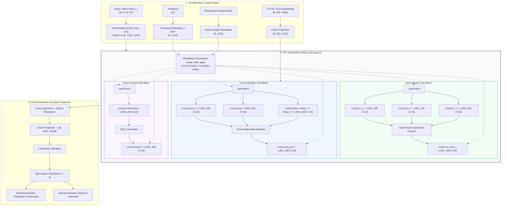
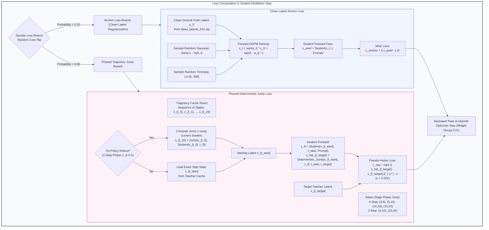
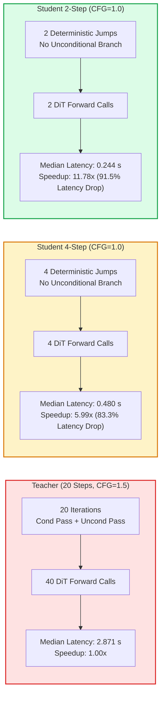
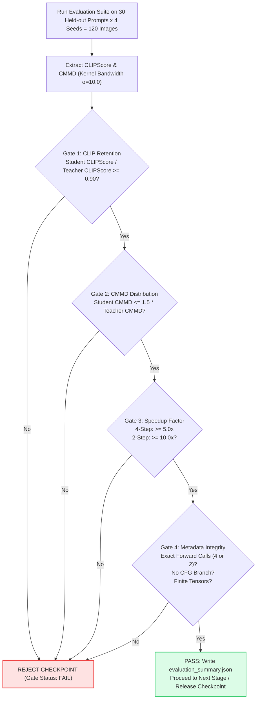

# System Architecture & Workflow Diagrams: Efficient PixArt-Sigma LoRA Distillation

This document visualizes the complete system architecture, model block composition, multi-stage distillation math flow, and runtime inference pathways for **Efficient PixArt-Sigma LoRA**.

---

## 1. End-to-End Training & Distillation Pipeline Flow

```mermaid
flowchart TD
    subgraph S0["Stage 0: Data & Feature Preparation"]
        D1["Raw Ink-Wash Scrapes / Kaggle Data<br/>(260 Images)"] --> D2["Florence-2 / JoyCaption<br/>Auto-Captioning"]
        D2 --> D3["Deterministic Filtering<br/>(209 Plant Captions)"]
        D3 --> D4["Precompute SDXL VAE Latents<br/>(4 x 64 x 64, FP16)"]
        D3 --> D5["Precompute T5-XXL Embeddings<br/>(300 tokens, 4096-dim, FP16)"]
        D4 --> D6[("data/archives/clean_latents_512.zip")]
        D5 --> D7[("data/features/t5_embeddings_n260.pt")]
    end

    subgraph S1["Stage 1: 20-Step Style Teacher Training"]
        D6 & D7 --> T1["Base PixArt-Sigma XL-2 (Frozen)"]
        T1 --> T2["Attach LoRA (Rank 16, Alpha 16)<br/>12 Official Target Modules"]
        T2 --> T3["Train 10,000 steps (AdamW, LR=1e-5)<br/>Standard DDPM MSE Loss"]
        T3 --> T4["outputs/style_teacher/...<br/>20-step Style Teacher LoRA"]
        T4 --> T5{"Validate Provenance &<br/>574 FP32 Tensors (13.76M Params)"}
        T5 -->|PASS| T6[("teacher_manifest.json")]
    end

    subgraph S2["Stage 2: Trajectory Caching"]
        T6 --> C1["build_distill_prompt_cache.py<br/>627 Bank Prompts + 30 Eval Prompts"]
        C1 --> C2[("distill_t5_plant627.pt")]
        C2 & T6 --> C3["cache_teacher_trajectories.py<br/>20-step Denoising Rollout (2 Replicas)"]
        C3 --> C4[("Trajectory Cache<br/>(1,254 trajectories x 21 states)")]
    end

    subgraph S3["Stage 3: 4-Step Joint LoRA Distillation"]
        C4 & C2 & D6 & T6 --> S3_1["Initialize from Style Teacher LoRA"]
        S3_1 --> S3_2["Train 2,000 steps (LR=5e-6)<br/>Phased Intervals: (0,5), (5,10), (10,15), (15,20)"]
        S3_2 --> S3_3["Loss = 80% Pseudo-Huber Jump Loss<br/>+ 20% Clean Latent Anchor Loss"]
        S3_3 --> S3_4[("Student 4-Step Best Adapter")]
    end

    subgraph S4["Stage 4: 4-Step Quality Gate Verification"]
        S3_4 --> Q1["generate_evaluation_set.py<br/>(30 Prompts x 4 Seeds = 120 Images)"]
        Q1 --> Q2["evaluate_distilled.py<br/>CLIPScore & CMMD Computation"]
        Q2 --> Q3{"Quality Gate Checks:<br/>1. CLIPScore >= 90% Teacher<br/>2. CMMD <= 1.5x Teacher<br/>3. Speedup >= 5.0x"}
        Q3 -->|FAIL| Q4["Reject / Retrain"]
        Q3 -->|PASS| Q5["Approved 4-Step Student"]
    end

    subgraph S5["Stage 5: 2-Step Joint LoRA Distillation"]
        Q5 & C4 & C2 & D6 --> S5_1["Initialize from Approved 4-Step Student"]
        S5_1 --> S5_2["Train 7,000 steps (LR=2e-6)<br/>Phased Intervals: (0,10), (10,20)"]
        S5_2 --> S5_3["Loss = 80% Jump Loss (50% On-Policy Rollout)<br/>+ 20% Clean Latent Anchor Loss"]
        S5_3 --> S5_4[("Student 2-Step Best Adapter")]
    end

    subgraph S6["Stage 6: Final 2-Step Quality Gate & Benchmark"]
        S5_4 --> F1["generate_evaluation_set.py<br/>(120 Images @ 2 Steps, guidance=1.0)"]
        F1 --> F2["evaluate_distilled.py &<br/>eval_30prompts_cmmd.py"]
        F2 --> F3{"Final Gate:<br/>Speedup >= 11x<br/>CLIPScore >= 95%<br/>Exact 2 DiT Calls"}
        F3 -->|PASS| F4["Production Ready Model<br/>(Latency: 0.244s, Speedup: 11.78x)"]
    end

    style S0 fill:#e8f4f8,stroke:#2b6cb0,stroke-width:2px;
    style S1 fill:#fef3c7,stroke:#d97706,stroke-width:2px;
    style S2 fill:#ede9fe,stroke:#7c3aed,stroke-width:2px;
    style S3 fill:#ecfdf5,stroke:#059669,stroke-width:2px;
    style S4 fill:#fff1f2,stroke:#e11d48,stroke-width:2px;
    style S5 fill:#ecfdf5,stroke:#059669,stroke-width:2px;
    style S6 fill:#f0fdf4,stroke:#16a34a,stroke-width:2px;
```

---

## 2. PixArt-Sigma Diffusion Transformer & LoRA Block Architecture

---

## 3. Mathematical Trajectory Jump & Distillation Loss Flow

---

## 4. Timestep Mapping & Sampling Schedules

```mermaid
gantt
    title Discrete Diffusion Timestep Progression
    dateFormat X
    axisFormat %s

    section Teacher 20-Step (CFG 1.5, 40 passes)
    999 to 949 :active, 0, 50
    949 to 899 :active, 50, 100
    899 to 849 :active, 100, 150
    849 to 799 :active, 150, 200
    799 to 749 :active, 200, 250
    749 to 699 :active, 250, 300
    699 to 649 :active, 300, 350
    649 to 599 :active, 350, 400
    599 to 549 :active, 400, 450
    549 to 500 :active, 450, 500
    500 to 450 :active, 500, 550
    450 to 400 :active, 550, 600
    400 to 350 :active, 600, 650
    350 to 300 :active, 650, 700
    300 to 250 :active, 700, 750
    250 to 200 :active, 750, 800
    200 to 150 :active, 800, 850
    150 to 100 :active, 850, 900
    100 to 50  :active, 900, 950
    50 to 0    :active, 950, 1000

    section Student 4-Step (CFG 1.0, 4 passes)
    Jump 1 (999 -> 749) :crit, 0, 250
    Jump 2 (749 -> 500) :crit, 250, 500
    Jump 3 (500 -> 250) :crit, 500, 750
    Jump 4 (250 -> 0)   :crit, 750, 1000

    section Student 2-Step (CFG 1.0, 2 passes)
    Jump 1 (999 -> 500) :done, 0, 500
    Jump 2 (500 -> 0)   :done, 500, 1000
```

---

## 5. Denoising Forward-Pass & Latency Comparison

---

## 6. Formal Quality Gate Validation Engine

