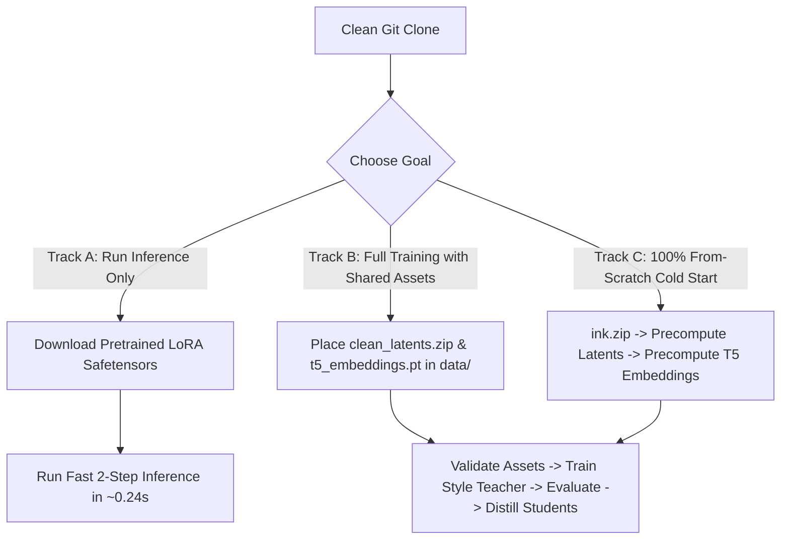

# End-to-End Instructions: PixArt-Sigma Ink-Wash LoRA Adaptation & Distillation

This guide provides complete, step-by-step instructions to train, distill, evaluate, and deploy the 20-step to 4-step to 2-step **PixArt-Sigma Ink-Wash LoRA** models from scratch.

> [!NOTE]
> All CLI commands default to Python 3.11.2 via `py -3.11.2`. If using Conda, activate the `pixart311` environment first (`conda activate pixart311`).

---

## 📑 Table of Contents

- [0. Prerequisites & Environment Setup](#0-prerequisites--environment-setup)
  - [0.1 Environment Setup & Dependencies](#01-environment-setup--dependencies)
  - [0.2 Clean GitHub Clone: Tracked vs. Excluded Files](#02-clean-github-clone-tracked-vs-excluded-files)
  - [0.3 Three Reproduction Tracks (Which One to Choose?)](#03-three-reproduction-tracks-which-one-to-choose)
- 🎨 **[Phase 1: Style Teacher Adaptation & Data Pipeline (Stages 0–5)](#phase-1-style-teacher-adaptation--data-pipeline)**
  - [1. Stage 0: Data Preparation & Precomputing Feature Caches](#1-stage-0-data-preparation--precomputing-feature-caches)
    - [1.1 Canonical Raw Image Archive (`data/ink.zip`)](#11-canonical-raw-image-archive-datainkzip)
    - [1.2 Automated VLM Captioning (Optional)](#12-automated-vlm-captioning-optional)
    - [1.3 Precomputing Clean SDXL VAE Latents (`clean_latents_512.zip`)](#13-precomputing-clean-sdxl-vae-latents-clean_latents_512zip)
    - [1.4 Precomputing T5-XXL Base Prompt Embeddings (`t5_embeddings_*.pt`)](#14-precomputing-t5-xxl-base-prompt-embeddings-t5_embeddings_pt)
    - [1.5 Dataset Asset Contract Validation](#15-dataset-asset-contract-validation)
  - [2. Stage 1: Style Teacher Training & Hyperparameter Sweeps (20-Step LoRA)](#2-stage-1-style-teacher-training--hyperparameter-sweeps-20-step-lora)
    - [2.1 Single Best Style Teacher Training (Rank 16, Alpha 16)](#21-single-best-style-teacher-training-rank-16-alpha-16)
    - [2.2 Sequential Multi-Rank Hyperparameter Sweep (Ranks 4, 8, 16, 32)](#22-sequential-multi-rank-hyperparameter-sweep-ranks-4-8-16-32)
    - [2.3 Training Matrix & Hardware Resource Telemetry](#23-training-matrix--hardware-resource-telemetry)
  - [3. Stage 2: Style Teacher Quality Evaluation & Progression Analysis](#3-stage-2-style-teacher-quality-evaluation--progression-analysis)
    - [3.1 Multi-Checkpoint Image Grid Generation](#31-multi-checkpoint-image-grid-generation)
    - [3.2 Quantitative CLIPScore Alignment Scoring](#32-quantitative-clipscore-alignment-scoring)
    - [3.3 Zero-Shot Generalization on Unseen Prompts](#33-zero-shot-generalization-on-unseen-prompts)
    - [3.4 Interactive Evaluation & Diagnostics Notebook](#34-interactive-evaluation--diagnostics-notebook)
  - [4. Stage 3: Teacher Provenance Validation & Manifest Export](#4-stage-3-teacher-provenance-validation--manifest-export)
  - [5. Stage 4: Distillation Prompt Banking & T5-XXL Caching](#5-stage-4-distillation-prompt-banking--t5-xxl-caching)
  - [6. Stage 5: 20-Step Teacher Trajectory Sharded Caching](#6-stage-5-20-step-teacher-trajectory-sharded-caching)
- ⚡ **[Phase 2: Fast Student LoRA Distillation & Quality Gating (Stages 6–10)](#phase-2-fast-student-lora-distillation--quality-gating)**
  - [7. Stage 6: Distillation Smoke Test & Verification](#7-stage-6-distillation-smoke-test--verification)
  - [8. Stage 7: Student 4-Step Distillation Training](#8-stage-7-student-4-step-distillation-training)
  - [9. Stage 8: 4-Step Quality Evaluation Gate](#9-stage-8-4-step-quality-evaluation-gate)
  - [10. Stage 9: Student 2-Step Distillation Training](#10-stage-9-student-2-step-distillation-training)
  - [11. Stage 10: Final 2-Step Quality Gate & Multi-Model Benchmarking](#11-stage-10-final-2-step-quality-gate--multi-model-benchmarking)
- 🚀 **[Phase 3: Automated Orchestration & Inference Deployment (Stages 11–12)](#phase-3-automated-orchestration--inference-deployment)**
  - [12. Stage 11: Single-Command Automated Orchestration Pipelines](#12-stage-11-single-command-automated-orchestration-pipelines)
  - [13. Stage 12: Fast Single-Image Inference Deployment & Acceptance Records](#13-stage-12-fast-single-image-inference-deployment--acceptance-records)

---

## 0. Prerequisites & Environment Setup

### 0.1 Environment Setup & Dependencies
Install dependencies using Python 3.11.2:

```powershell
py -3.11.2 -m pip install -r requirements.txt
```

Alternatively, if using Conda:
```powershell
conda env create -f environment.yml
conda activate pixart311
```

---

### 0.2 Clean GitHub Clone: Tracked vs. Excluded Files

When you clone this repository fresh from GitHub, large data binaries and checkpoints are excluded by `.gitignore` due to GitHub storage limits. Here is what is present versus what is created dynamically:

| Component | Status in Clean Git Clone | How to Obtain / Generate |
| :--- | :--- | :--- |
| **Source Code & Tests** (`scripts/`, `tests/`) | ✅ **Tracked** | Present immediately after cloning. |
| **Evaluation Prompts & Metrics** (`evaluation/`) | ✅ **Tracked** | 30 held-out evaluation prompts and benchmark CSVs are tracked. |
| **Model Cards & Configs** (`models/*/adapter_config.json`) | ✅ **Tracked** | Parameter configurations and JSON metadata are tracked. |
| **Base Model Weights** (`PixArt-Sigma-XL-2-512-MS`) | ☁️ **Auto-Downloaded** | Downloaded automatically from Hugging Face on first execution. |
| **Raw Images & Captions** (`data/ink.zip`) | ✅ **Tracked / Included** | Canonical archive of 260 paired images and `.txt` captions. |
| **Clean Latent Bundle** (`data/archives/clean_latents_512.zip`) | 📦 **Excluded** | Download from shared team storage OR build from `data/ink.zip` (Stage 0.3). |
| **T5 Prompt Embeddings** (`data/features/*.pt`) | 📦 **Excluded** | Download from shared storage OR build using Stage 0.4 (base) / Stage 4 (distillation). |
| **LoRA Safetensors Weights** (`adapter_model.safetensors`) | 📦 **Excluded** | Download from model releases OR train locally via Stages 1–9. |
| **Trajectory Caches & Outputs** (`outputs/`) | ⚙️ **Generated** | Built dynamically during distillation stages. |

---

### 0.3 Three Reproduction Tracks (Which One to Choose?)

Depending on your goal, choose one of the three paths below:



- **Track A: Quick Inference & Evaluation Only**
  - Download the pre-trained `adapter_model.safetensors` via the built-in downloader:
    ```powershell
    py -3.11.2 scripts/inference/download_adapters.py --model teacher_b_primary_2step
    ```
  - Jump directly to [Stage 12: Fast Single-Image Inference Deployment](#13-stage-12-fast-single-image-inference-deployment--acceptance-records).
  - The base PixArt-Sigma model downloads automatically from Hugging Face.

- **Track B: Training & Distillation with Shared Asset Bundle (Standard Reproduction)**
  - Place `data/ink.zip`, `data/archives/clean_latents_512.zip`, and `data/features/t5_embeddings_n260_len300_fp16_b9d3c2d1d404.pt` into their respective directories.
  - Validate assets with `py -3.11.2 scripts/training/train_local_latent_lora.py --validate-assets-only`.
  - Proceed with [Stage 1: Style Teacher Training](#2-stage-1-style-teacher-training-20-step-lora), [Stage 2: Style Teacher Evaluation](#3-stage-2-style-teacher-quality-evaluation--progression-analysis), or [Stage 7: Student Distillation](#8-stage-7-student-4-step-distillation-training).

- **Track C: 100% From-Scratch Cold Start (Zero External Precomputed Caches Required)**
  - Start from [Stage 0: Data Preparation & Precomputing Feature Caches](#1-stage-0-data-preparation--precomputing-feature-caches) to build clean SDXL VAE latents and base T5 embeddings directly from `data/ink.zip`.

---

## Phase 1: Style Teacher Adaptation & Data Pipeline

### 1. Stage 0: Data Preparation & Precomputing Feature Caches

If starting completely from scratch without existing precomputed feature caches:

#### 1.1 Canonical Raw Image Archive (`data/ink.zip`)
The repository includes the canonical 260-sample dataset directly as `data/ink.zip`, containing:
- 260 paired RGB images and `.txt` captions across 4 categories (`plant`: 209, `animal`: 30, `web`: 11, `others`: 10).
- Deterministic manifest SHA256 fingerprint: `b9d3c2d1d404`.
- All downstream precomputation tools read `data/ink.zip` directly without any web scraping required.

#### 1.2 Automated VLM Captioning (Optional)
Captions are already curated inside `data/ink.zip`. If you wish to re-caption or extend the dataset with custom domain trigger words using **JoyCaption**:
```powershell
py -3.11.2 scripts/data/auto_caption.py `
  --dir data/ink/plant `
  --model joycaption `
  --trigger "traditional Chinese ink wash painting style, shuimo hua"
```

#### 1.3 Precomputing Clean SDXL VAE Latents (`clean_latents_512.zip`)
Encode preprocessed 512×512 images (aspect-ratio-preserving LANCZOS center crop, $[-1, 1]$ normalized) into clean `[260, 4, 64, 64]` FP16 latents using the SDXL VAE bundled with PixArt-Sigma (`scaling_factor=0.13025`).

**Option A: Local CLI Generation & Bundling**
```powershell
py -3.11.2 scripts/data/precompute_clean_latents.py `
  --image-archive data/ink.zip `
  --output-zip data/archives/clean_latents_512.zip `
  --batch-size 8 `
  --seed 42
```

**Option B: Google Colab / Cloud GPU Execution**
Open and run [notebooks/preprocessing/pixart_clean_latents_colab.ipynb](file:///C:/dev/efficient-pixart-sigma-lora/notebooks/preprocessing/pixart_clean_latents_colab.ipynb) on a free T4 GPU to encode the images, inspect reconstruction grids, and download the resulting `clean_latents_512.zip`.

> [!NOTE]
> The resulting `clean_latents_512.zip` contains:
> - `manifest.jsonl`: Deterministic sample IDs, image/caption paths, and dimensions.
> - `image_latents_n260_res512_b9d3c2d1d404.pt`: `[260, 4, 64, 64]` FP16 scaled $x_0$ latents.
> - `validation_summary.json`: Verifiable tensor statistics and SHA256 manifest fingerprint `b9d3c2d1d404`.

#### 1.4 Precomputing T5-XXL Base Prompt Embeddings (`t5_embeddings_*.pt`)
Tokenize the 260 captions to 300 tokens and pre-encode them into FP16 embeddings (`[260, 300, 4096]`) using Google's T5-XXL text encoder. This step also encodes the empty prompt `""` for unconditional Classifier-Free Guidance (CFG).

```powershell
py -3.11.2 scripts/data/precompute_t5_embeddings.py `
  --latent-bundle data/archives/clean_latents_512.zip `
  --output-cache data/features/t5_embeddings_n260_len300_fp16_b9d3c2d1d404.pt `
  --t5-gpu-memory 8GiB `
  --t5-cpu-memory 24GiB `
  --batch-size 8
```

#### 1.5 Dataset Asset Contract Validation
Verify alignment between `data/ink.zip`, `clean_latents_512.zip`, and `t5_embeddings_n260_len300_fp16_b9d3c2d1d404.pt` before starting training:

```powershell
py -3.11.2 scripts/training/train_local_latent_lora.py --validate-assets-only
```

---

### 2. Stage 1: Style Teacher Training & Hyperparameter Sweeps (20-Step LoRA)

Train the domain-specific 20-step Style Teacher adapter on the plant subset (or full 260-sample dataset) using the frozen PixArt-Sigma 512 base model.

#### 2.1 Single Best Style Teacher Training (Rank 16, Alpha 16)
Train the primary benchmark teacher configuration ($r=16, \alpha=16$, 13.76M trainable parameters) on the 209 plant images:

```powershell
py -3.11.2 scripts/training/train_local_latent_lora.py `
  --latent-bundle data/archives/clean_latents_512.zip `
  --prompt-cache data/features/t5_embeddings_n260_len300_fp16_b9d3c2d1d404.pt `
  --plant-only `
  --rank 16 `
  --lora-alpha 16 `
  --max-train-steps 10000 `
  --learning-rate 1e-5 `
  --train-batch-size 1 `
  --gradient-accumulation-steps 1 `
  --mixed-precision fp16 `
  --checkpointing-steps 1000 `
  --seed 42 `
  --output-dir outputs/style_teacher/plant_n209_steps10200/r16_lr1e-05
```

#### 2.2 Sequential Multi-Rank Hyperparameter Sweep (Ranks 4, 8, 16, 32)
To explore rank capacity and learning rate scaling across all canonical datasets ($n=260$), execute the sequential multi-rank hyperparameter sweep:

```powershell
py -3.11.2 scripts/training/train_style_teacher_sweep.py `
  --latent-bundle data/archives/clean_latents_512.zip `
  --prompt-cache data/features/t5_embeddings_n260_len300_fp16_b9d3c2d1d404.pt `
  --ranks 4 8 16 32 `
  --learning-rate 1e-5 `
  --max-train-steps 10000 `
  --checkpoint-every-steps 1000 `
  --num-images 260 `
  --train-batch-size 1 `
  --gradient-accumulation-steps 1 `
  --seed 42 `
  --output-root outputs/style_teacher/all_n260_steps10000
```

> [!TIP]
> Add `--dry-run` to `train_style_teacher_sweep.py` to validate argument paths and print/record all execution commands without launching GPU training.

#### 2.3 Training Matrix & Hardware Resource Telemetry
The multi-rank sweep scales parameters while maintaining an ultra-light GPU VRAM footprint:

| Configuration | LoRA Rank | Trainable Parameters | Trainable Tensors | Peak VRAM | Training Speed |
| :--- | :---: | :---: | :---: | :---: | :---: |
| **`r4_lr1e-05`** | $r=4$ | 3,441,344 | 574 | ~5.32 GB | ~0.70 s / step |
| **`r8_lr1e-05`** | $r=8$ | 6,882,688 | 574 | ~5.36 GB | ~0.70 s / step |
| **`r16_lr1e-05` (Primary)** | $r=16$ | 13,765,376 | 574 | ~5.42 GB | ~0.71 s / step |
| **`r32_lr1e-05`** | $r=32$ | 27,530,752 | 574 | ~5.58 GB | ~0.72 s / step |

Interactive telemetry, loss curves, and parameter comparisons can be analyzed via [notebooks/evaluation/pixart_matrix_analysis.ipynb](file:///C:/dev/efficient-pixart-sigma-lora/notebooks/evaluation/pixart_matrix_analysis.ipynb) and [notebooks/evaluation/training_10k_report.ipynb](file:///C:/dev/efficient-pixart-sigma-lora/notebooks/evaluation/training_10k_report.ipynb).

---

### 3. Stage 2: Style Teacher Quality Evaluation & Progression Analysis

Before distilling the 20-step Style Teacher into fast student models, evaluate checkpoint visual quality, text-image CLIPScore alignment progression, and stylistic generalization on unseen prompts.

#### 3.1 Multi-Checkpoint Image Grid Generation
Generate same-prompt, same-seed side-by-side comparison grids tracking the evolution of ink-wash brush strokes across intermediate training checkpoints (e.g., Step 0 Base Model vs. Step 1,000 to Step 10,000 checkpoints for single rank or across the entire $r \in \{4, 8, 16, 32\}$ sweep):

```powershell
# For single-rank evaluation (e.g. Rank 16):
py -3.11.2 scripts/evaluation/generate_style_teacher_checkpoint_grids.py `
  --model-root outputs/style_teacher/plant_n209_steps10200 `
  --include-base-model `
  --ranks 16 `
  --output-dir outputs/evaluation/style_teacher_grids `
  --prompt "A solitary white crane gliding above a misty lotus pond at dawn, distant mountains fading into pale ink, sparse composition, Chinese ink wash painting style, sumi-e" `
  --seed 42 `
  --num-inference-steps 20 `
  --guidance-scale 1.5

# For multi-rank sweep evaluation (Ranks 4, 8, 16, 32):
py -3.11.2 scripts/evaluation/generate_style_teacher_checkpoint_grids.py `
  --model-root outputs/style_teacher/all_n260_steps10000 `
  --include-base-model `
  --ranks 4 8 16 32 `
  --output-dir outputs/evaluation/style_teacher_grids_sweep
```

#### 3.2 Quantitative CLIPScore Alignment Scoring & Variant Comparison
Calculate automated CLIP text-image cosine similarity scores (`openai/clip-vit-base-patch32`) across the generated checkpoint images to measure semantic alignment and style adherence over training steps and across rank variants:

```powershell
py -3.11.2 scripts/evaluation/evaluate_style_teacher_clip_score.py `
  --source-evaluation-dir outputs/evaluation/style_teacher_grids `
  --output-dir outputs/evaluation/style_teacher_clip_scores `
  --ranks 16 `
  --clip-model openai/clip-vit-base-patch32
```
This outputs:
- `clip_scores.png`: Visual alignment progression curve across training checkpoints.
- `clip_scores.json` and `clip_scores.csv`: Numerical alignment scores, mean, and standard deviation per checkpoint.

To compare all final hyperparameter variants (e.g. Rank 4 vs 8 vs 16 vs 32) directly against the Step 0 Base Model:
```powershell
py -3.11.2 scripts/evaluation/evaluate_final_variant_clip_score.py `
  --source-dir outputs/evaluation/style_teacher_grids_sweep `
  --output-dir outputs/evaluation/style_teacher_variant_scores
```

#### 3.3 Zero-Shot Generalization on Unseen Prompts
Test whether the Style Teacher adapter successfully transfers traditional Chinese ink-wash aesthetics (e.g. wet-on-wet shading, negative space, dry brush textures) to novel, unseen prompt compositions:

```powershell
py -3.11.2 scripts/inference/generate_with_prompt.py `
  --prompt "Ancient pine tree clinging to a rugged granite cliff above a sea of clouds, traditional Chinese ink wash painting style, shuimo hua" `
  --adapter outputs/style_teacher/plant_n209_steps10200/r16_lr1e-05 `
  --num-inference-steps 20 `
  --guidance-scale 1.5 `
  --seed 123 `
  --output outputs/evaluation/teacher_unseen_pine_cliff.png
```

#### 3.4 Interactive Evaluation & Diagnostics Notebook
For in-depth visual analysis, baseline comparison, and parameter inspection:
- Open and run [notebooks/evaluation/pixart_data_prep_teacher_eval.ipynb](file:///C:/dev/efficient-pixart-sigma-lora/notebooks/evaluation/pixart_data_prep_teacher_eval.ipynb) to inspect:
  1. Base vs. Teacher side-by-side galleries across 4 traditional themes (Landscapes, Flora & Fauna, Minimalist, Architecture).
  2. Adapter weight tensors (574 tensors, 13.76M params) and rank/alpha configurations.
  3. CLIPScore progression curves comparing Step 0 baseline against intermediate teacher checkpoints.

---

### 4. Stage 3: Teacher Provenance Validation & Manifest Export

Validates base model hashes, 574 adapter tensors, 13,765,376 parameters, and exports the teacher manifest:

```powershell
py -3.11.2 scripts/distillation/validate_style_teacher.py `
  --teacher-adapter outputs/style_teacher/plant_n209_steps10200/r16_lr1e-05 `
  --teacher-id plant_n209_r16_step10200 `
  --teacher-guidance-scale 1.0 `
  --output outputs/distillation/plant_n209_r16_step10200/teacher_manifest.json
```

---

### 5. Stage 4: Distillation Prompt Banking & T5-XXL Caching

Generates 627 training prompts (3 variants per plant image: `original`, `subject`, `styled`) and 30 held-out evaluation prompts, caching FP16 T5-XXL embeddings:

```powershell
py -3.11.2 scripts/distillation/build_distill_prompt_cache.py `
  --latent-bundle data/archives/clean_latents_512.zip `
  --source-prompt-cache data/features/t5_embeddings_n260_len300_fp16_b9d3c2d1d404.pt `
  --prompt-bank data/distillation/plant_prompt_bank_v1.jsonl `
  --evaluation-prompts evaluation/distillation_prompts_v1.json `
  --output-cache data/features/distill_t5_plant627_len300_fp16_v1.pt
```

> [!TIP]
> Use `--text-only` on `build_distill_prompt_cache.py` to inspect the generated JSONL prompt bank without loading the heavy T5-XXL text encoder.

---

### 6. Stage 5: 20-Step Teacher Trajectory Sharded Caching

Rolls out the teacher model across all 627 prompts and 2 deterministic seed replicas, saving 21 latent states ($x_0, x_1, \dots, x_{20}$) per trajectory into SHA256-verified safetensors shards:

```powershell
py -3.11.2 scripts/distillation/cache_teacher_trajectories.py `
  --teacher-manifest outputs/distillation/plant_n209_r16_step10200/teacher_manifest.json `
  --prompt-cache data/features/distill_t5_plant627_len300_fp16_v1.pt `
  --output-dir outputs/distillation/plant_n209_r16_step10200/trajectory_cache_v1 `
  --replicas-per-prompt 2 `
  --shard-size 64
```

---

## Phase 2: Fast Student LoRA Distillation & Quality Gating

### 7. Stage 6: Distillation Smoke Test & Verification

Validates both teachers, caches 4 prompts $\times$ 2 seeds per teacher, and trains 20 optimizer updates for each 4-step student to verify setup integrity:

```powershell
py -3.11.2 scripts/distillation/run_two_teacher_distillation.py `
  --smoke `
  --stop-after 4step `
  --output-root outputs/distillation_smoke
```

Generate a single test image from the smoke-trained checkpoint:
```powershell
py -3.11.2 scripts/distillation/generate_distilled.py `
  --prompt-id plant/220::original `
  --prompt-cache data/features/distill_t5_plant627_len300_fp16_v1.pt `
  --adapter outputs/distillation_smoke/plant_n209_r16_step10200/student_4step/lora_adapter `
  --num-inference-steps 4 `
  --guidance-scale 1.0 `
  --seed 42 `
  --output outputs/distillation_smoke/fresh_reload_4step.png
```

---

### 8. Stage 7: Student 4-Step Distillation Training

Distills 20 teacher steps into 4 student jumps: $[(0\to 5), (5\to 10), (10\to 15), (15\to 20)]$ using Pseudo-Huber jump loss (`huber_c=0.001`) and a 20% clean-latent anchor loss:

```powershell
py -3.11.2 scripts/distillation/train_phased_distill_lora.py `
  --trajectory-cache outputs/distillation/plant_n209_r16_step10200/trajectory_cache_v1 `
  --prompt-cache data/features/distill_t5_plant627_len300_fp16_v1.pt `
  --latent-bundle data/archives/clean_latents_512.zip `
  --init-adapter outputs/style_teacher/plant_n209_steps10200/r16_lr1e-05 `
  --target-steps 4 `
  --max-train-steps 2000 `
  --learning-rate 5e-6 `
  --checkpoint-every-steps 500 `
  --anchor-probability 0.2 `
  --huber-c 0.001 `
  --output-dir outputs/distillation/plant_n209_r16_step10200/student_4step
```

---

### 9. Stage 8: 4-Step Quality Evaluation Gate

Generate the 120-image evaluation suite (30 held-out prompts $\times$ 4 seeds) and compute quality retention metrics:

#### 9.1 Generate Image Sets (Teacher & 4-Step Student)
```powershell
py -3.11.2 scripts/distillation/generate_evaluation_set.py `
  --teacher-manifest outputs/distillation/plant_n209_r16_step10200/teacher_manifest.json `
  --student-adapter outputs/distillation/plant_n209_r16_step10200/student_4step/best_adapter `
  --student-steps 4 `
  --evaluation-prompts evaluation/distillation_prompts_v1.json `
  --output-dir outputs/distillation/plant_n209_r16_step10200/evaluation_4step/images
```

#### 9.2 Compute Quality Metrics
```powershell
py -3.11.2 scripts/distillation/evaluate_distilled.py `
  --teacher-images outputs/distillation/plant_n209_r16_step10200/evaluation_4step/images/teacher `
  --student-images outputs/distillation/plant_n209_r16_step10200/evaluation_4step/images/student `
  --evaluation-prompts evaluation/distillation_prompts_v1.json `
  --output-dir outputs/distillation/plant_n209_r16_step10200/evaluation_4step/metrics
```

> [!IMPORTANT]
> **4-Step Quality Gate Acceptance Rules**:
> - **CLIPScore Retention**: Mean Student CLIPScore $\ge 90\%$ of Teacher CLIPScore.
> - **CMMD Distance**: Student CMMD $\le 1.5\times$ Teacher CMMD (unbiased squared MMD between normalized CLIP image embeddings with Gaussian RBF kernel).
> - **Inference Speedup**: Median denoising latency speedup $\ge 5\times$.

---

### 10. Stage 9: Student 2-Step Distillation Training

Initialize the 2-step student directly from the best 4-step adapter. In this stage, two jump intervals are learned: $[(0\to 10), (10\to 20)]$, utilizing **50% On-Policy Rollout Matching** on the second jump to eliminate compounding errors.

```powershell
py -3.11.2 scripts/distillation/train_phased_distill_lora.py `
  --trajectory-cache outputs/distillation/plant_n209_r16_step10200/trajectory_cache_v1 `
  --prompt-cache data/features/distill_t5_plant627_len300_fp16_v1.pt `
  --latent-bundle data/archives/clean_latents_512.zip `
  --init-adapter outputs/distillation/plant_n209_r16_step10200/student_4step/best_adapter `
  --target-steps 2 `
  --max-train-steps 7000 `
  --learning-rate 2e-6 `
  --checkpoint-every-steps 1000 `
  --anchor-probability 0.2 `
  --on-policy-probability 0.5 `
  --huber-c 0.001 `
  --output-dir outputs/distillation/plant_n209_r16_step10200/student_2step
```

---

### 11. Stage 10: Final 2-Step Quality Gate & Multi-Model Benchmarking

#### 11.1 Generate Evaluation Set for 2-Step Student
```powershell
py -3.11.2 scripts/distillation/generate_evaluation_set.py `
  --teacher-manifest outputs/distillation/plant_n209_r16_step10200/teacher_manifest.json `
  --student-adapter outputs/distillation/plant_n209_r16_step10200/student_2step/best_adapter `
  --student-steps 2 `
  --evaluation-prompts evaluation/distillation_prompts_v1.json `
  --output-dir outputs/distillation/plant_n209_r16_step10200/evaluation_2step/images
```

#### 11.2 Evaluate Final 2-Step Quality & Latency
```powershell
py -3.11.2 scripts/distillation/evaluate_distilled.py `
  --teacher-images outputs/distillation/plant_n209_r16_step10200/evaluation_2step/images/teacher `
  --student-images outputs/distillation/plant_n209_r16_step10200/evaluation_2step/images/student `
  --evaluation-prompts evaluation/distillation_prompts_v1.json `
  --output-dir outputs/distillation/plant_n209_r16_step10200/evaluation_2step/metrics
```

#### 11.3 30-Prompt Benchmark & CMMD Distribution Evaluation
```powershell
py -3.11.2 scripts/inference/eval_30prompts_cmmd.py `
  --guidance-scale 1.0 `
  --seed 42 `
  --output-root outputs/benchmark_30prompts
```

---

## Phase 3: Automated Orchestration & Inference Deployment

### 12. Stage 11: Single-Command Automated Orchestration Pipelines

#### 12.1 Two-Teacher End-to-End Orchestration (Resume-Safe)
Runs validation, caching, 4-step training, quality gating, and 2-step training for both Teacher A and Teacher B:
```powershell
py -3.11.2 scripts/distillation/run_two_teacher_distillation.py `
  --output-root outputs/distillation
```

#### 12.2 Primary Benchmark Experiment (Teacher B 6k $\to$ 2-Step 7k)
Reproduces the primary headline result reported in the repository:
```powershell
py -3.11.2 scripts/distillation/run_teacher_b_extended_6k_then_2step.py
```

> [!NOTE]
> For exploratory work, passing `--skip-quality-gate` allows the runner to proceed directly to 2-step training without waiting for a passing 4-step report.

---

### 13. Stage 12: Fast Single-Image Inference Deployment & Acceptance Records

Generate a 512x512 ink-wash painting in ~0.24 seconds using the 2-step distilled LoRA:

```powershell
py -3.11.2 scripts/distillation/generate_distilled.py `
  --prompt "Misty mountain peaks enveloped in soft clouds, ancient pine tree on a cliff, traditional Chinese ink wash painting style, shuimo hua" `
  --adapter outputs/distillation/plant_n209_r16_step10200/student_2step/lora_adapter `
  --num-inference-steps 2 `
  --guidance-scale 1.0 `
  --seed 42 `
  --output outputs/inference_results/misty_mountains_2step.png
```

#### Acceptance Record Verification
The generator writes an adjacent `.json` metadata sidecar with the image. The acceptance criteria strictly assert:
- `transformer_forward_calls: 2`
- `classifier_free_guidance_branch: false`
- `guidance_scale: 1.0`
- Finite latent values and $512 \times 512$ image output.
