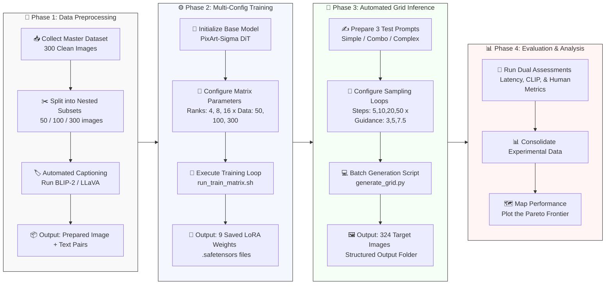

# efficient-pixart-sigma-lora

Domain adaptation and efficient inference sampling benchmarks for PixArt-Sigma (DiT) using LoRA. Explores resource-constrained fine-tuning and optimal sampling configurations for specialized text-to-image generation.

Training setup: GPU NVIDIA GeForce RTX 4070 12GB

## Data Source

This project now uses a local ink-wash image corpus collected from Tappu via the scraper script [download_tappu.py](download_tappu.py). The script crawls the Tappu gallery pages, downloads representative images, translates article text to English, and saves the outputs into the local folders:

- [data/ink/animal](data/ink/animal)
- [data/ink/plant](data/ink/plant)
- [data/ink/others](data/ink/others)

Each downloaded item produces an image file plus a matching `.txt` caption file.

## 📋 Project Execution Pipeline

```
[💾 Phase 1: Data] ──> [⚙️ Phase 2: Train Matrix] ──> [🔮 Phase 3: Grid Inference] ──> [📊 Phase 4: Evaluation]
  - 📥 Collect & Clean    - 📐 3 Ranks (4, 8, 16)       - ⏱️ 4 Steps (5, 10, 20, 50)    - 🤖 Quantitative (CLIP)
  - 🏷️ Auto-Captioning    - 📈 3 Data Scales            - 🎯 3 Guidance Scales          - 👥 Qualitative (Human)
  - ✂️ Split Subsets      - 💾 9 LoRA Weights Total     - ✍️ 3 Prompt Complexities      - 🗺️ Pareto Frontier Plot

```



---

## Phase 1: Data Architecture & Preprocessing

Before touching any GPU code, you must build a local dataset in a deterministic structure so that training and evaluation are reproducible.

### 1. Collecting the Source Data

Run [download_tappu.py](download_tappu.py) from the project root to scrape the Tappu gallery and populate the local dataset folders:

```bash
python download_tappu.py
```

The script downloads images and translated captions into the following structure:

```bash
data/ink/
├── animal/
│   ├── 100.jpg
│   ├── 100.txt
│   └── ...
├── plant/
│   ├── 200.jpg
│   ├── 200.txt
│   └── ...
└── others/
    ├── no_num_1001.jpg
    ├── no_num_1001.txt
    └── ...
```

These local image folders are then used directly by the notebook workflow and the captioning script.

### 2. Automated Captioning

Do not caption manually. Use [auto_caption.py](auto_caption.py) to generate a matching `.txt` file for every image in the local dataset folder.

```bash
python auto_caption.py --dir ./data/ink --model florence-2 --trigger "traditional Chinese ink wash painting style, shuimo hua"
```

The notebook is configured to point at the local dataset under [data/ink](data/ink), so the captioning step can be run directly on that folder.

---

## Phase 2: Environment & Multi-Configuration Training

Since you need to train **9 distinct LoRA models** ($3 \text{ Ranks} \times 3 \text{ Data Scales}$), your best approach is writing a simple bash script to loop through the training matrix sequentially.

### 1. Core Stack

- **Framework:** Hugging Face `diffusers` + PyTorch.
- **Base Model:** `PixArt-alpha/PixArt-Sigma-XL-2-1024-MS` (or the 512 variant if VRAM is tight).
- **Script base:** Modify the standard `train_text_to_image_lora.py` from Hugging Face's example repository to support PixArt-Sigma.

### 2. The Training Loop Automation Script (`run_train_matrix.sh`)

Instead of running commands manually 9 times, use this automated script layout:

```bash
#!/bin/bash
# Hyperparameter Arrays
RANKS=(4 8 16)
DATA_DIRS=("dataset_50" "dataset_100" "dataset_300")

for rank in "${RANKS[@]}"; do
  for data_dir in "${DATA_DIRS[@]}"; do
    echo "Running Training: Rank=$rank, Data=$data_dir"
    
    python train_text_to_image_lora.py \
      --pretrained_model_name_or_path="PixArt-alpha/PixArt-Sigma-XL-2-1024-MS" \
      --train_data_dir="./data/$data_dir" \
      --rank=$rank \
      --output_dir="./outputs/lora_r${rank}_${data_dir}" \
      --resolution=1024 \
      --train_batch_size=4 \
      --max_train_steps=1000 \
      --checkpointing_steps=500 \
      --learning_rate=1e-4 \
      --seed=42
  done
done

```

---

## Phase 3: Automated Grid Inference (Sampling Phase)

Once training finishes, you will have 9 `.safetensors` files. Now you must evaluate them against the remaining variables: **4 Step configurations**, **3 Guidance Scales**, and **3 Prompts**.

> ⚠️ **Warning:** $9 \text{ models} \times 4 \text{ steps} \times 3 \text{ guidance scales} \times 3 \text{ prompts} = 324 \text{ generated images}$. **Do not do this manually.**

### 1. Setup Test Prompts

Prepare 3 specific prompt templates of escalating complexity:

- `PROMPT_SIMPLE`: "A car, [your style tag]."
- `PROMPT_COMBO`: "A sports car driving through a city street, [your style tag]."
- `PROMPT_COMPLEX`: "A futuristic aerodynamic sports car speeding down a neon-lit cyberpunk alleyway, intricate details, flawless [your style tag]."

### 2. Automated Evaluation Script (`generate_grid.py`)

Write an inference script that automatically loops through your parameters and names files systematically:

```python
import os
import itertools
from diffusers import PixArtSigmaPipeline
import torch

# Configuration Matrix
ranks = [4, 8, 16]
datasets = ["dataset_50", "dataset_100", "dataset_300"]
steps_list = [5, 10, 20, 50]
guidance_list = [3.0, 5.0, 7.5]
prompts = {"simple": "...", "combo": "...", "complex": "..."}

# Load Base Pipeline
pipe = PixArtSigmaPipeline.from_pretrained("PixArt-alpha/PixArt-Sigma-XL-2-1024-MS", torch_dtype=torch.float16).to("cuda")

# Nested Grid Generation Loop
for r, d in itertools.product(ranks, datasets):
    lora_path = f"./outputs/lora_r{r}_{d}"
    pipe.load_lora_weights(lora_path)
    
    for steps, g_scale, p_name in itertools.product(steps_list, guidance_list, prompts.keys()):
        # Set deterministic seed for fair comparison
        generator = torch.Generator("cuda").manual_seed(42)
        
        image = pipe(
            prompts[p_name], 
            num_inference_steps=steps, 
            guidance_scale=g_scale,
            generator=generator
        ).images[0]
        
        # Save file with completely trackable metadata in the name
        filename = f"r{r}_{d}_step{steps}_g{g_scale}_{p_name}.png"
        image.save(os.path.join("./inference_results", filename))

```

---

## Phase 4: Metrics Collection & Analysis

With your 324 images sorted, finalize your study by mapping out the metrics.

### 1. Quantitative (Code-Driven)

- **Latency Tracking:** In your `generate_grid.py` script, wrap your `pipe()` call with `time.time()` to log exactly how many milliseconds each inference combination takes. Save these directly to a CSV file.
- **CLIPScore / ImageReward:** Write a fast batch script to load your generated images alongside their input text prompts to compute automated text-alignment scores.

### 2. Qualitative (Human Blind Test)

- Pick a subset of the images (e.g., focusing only on the `complex` prompt).
- Create a simple shared spreadsheet for your team. Grade images from 1 to 5 on two clear elements:
- *Style Alignment:* Did it actually look like tech line art/ink wash, or did it bleed back into a generic photo?
- *Structural Integrity:* Are the lines clean, or did the architecture or text turn into chaotic gibberish?

### 3. Deliverable Presentation (The Pareto Frontier)

Plot a 2D scatter plot where:

- **X-axis:** Inference Time (Latency in seconds).
- **Y-axis:** Quality Score (CLIPScore or Human Rating).

Your goal in your final presentation is to draw a line connecting the top-leftmost points. This line represents your **Pareto Frontier**—showing your class exactly where the optimal "quality-speed sweet spots" live when deploying a fine-tuned DiT model with constrained resources.
