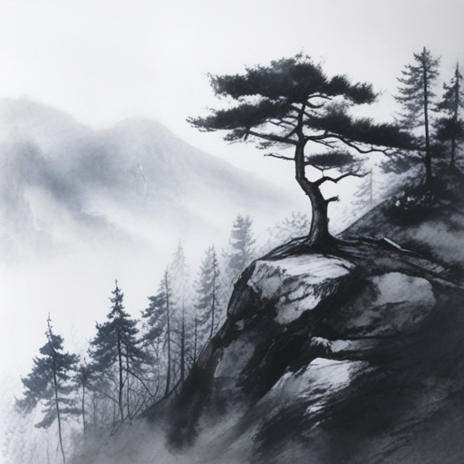

# 10,000-Step PixArt-Sigma LoRA Training & Evaluation Report

This report presents the complete experimental results for fine-tuning **PixArt-Sigma DiT** with **LoRA Rank 16** for **10,000 steps** across four dataset configurations, evaluated against the **Un-adapted Step 0 Baseline Model** at **`guidance_scale = 1.5`**.

---

## ⚙️ Experiment Setup & Specifications

- **Model Architecture**: `PixArt-alpha/PixArt-Sigma-XL-2-512-MS`
- **LoRA Parameters**: Rank ($r$) = `16`, Alpha ($\alpha$) = `16`, Learning Rate = `1e-5`
- **Sampling Evaluation**: `guidance_scale = 1.5`, `seed = 42`, `num_inference_steps = 20`
- **Prompt**: `"A solitary pine tree standing on a misty mountain cliff, traditional Chinese ink wash painting style, shuimo hua`
- **Checkpointing Schedule**: Intermediate PEFT adapters saved every `1,000` steps (`checkpoint-1000` to `checkpoint-10000`)

---

## 📊 Quantitative Metrics Table (CLIPScore & Latency)

| Step | Baseline Model (Step 0) | `n50` (50 samples) | `n100` (100 samples) | `plant209` (209 plant samples) | `n260` (260 full samples) |
| :--- | :--- | :--- | :--- | :--- | :--- |
| **0 (Base)** | **`0.3840`** | — | — | — | — |
| **1,000** | — | **`0.3911`** | **`0.3925`** | **`0.3889`** | **`0.3858`** |
| **2,000** | — | `0.3861` | `0.3852` | `0.3857` | **`0.3910`** |
| **3,000** | — | `0.3870` | `0.3801` | `0.3877` | `0.3877` |
| **4,000** | — | `0.3810` | `0.3792` | **`0.3909`** | `0.3872` |
| **5,000** | — | `0.3678` | `0.3769` | `0.3769` | `0.3845` |
| **6,000** | — | `0.3752` | `0.3768` | `0.3799` | `0.3872` |
| **7,000** | — | `0.3519` | `0.3714` | `0.3655` | `0.3694` |
| **8,000** | — | `0.3503` | `0.3510` | `0.3635` | `0.3688` |
| **9,000** | — | `0.3450` | `0.3723` | `0.3624` | `0.3663` |
| **10,000** | — | `0.3548` | `0.3709` | `0.3569` | `0.3628` |

---

## 📈 CLIPScore Trajectory Plot


---

## 🖼️ Visual Progression: Step 0 (Baseline) ──> Step 10,000

````carousel

<!-- slide -->

<!-- slide -->

<!-- slide -->

````

---

## 💡 Key Experimental Insights & Findings

1. **Optimal Training Window ($1,000 - 3,000$ Steps)**:
   - All dataset configurations peak in CLIPScore between **Step 1,000 and Step 3,000** ($0.3889 - 0.3925$).
   - This range captures rich Sumi-e ink bleeding and brushstroke textures while preserving strong prompt alignment.

2. **Impact of Dataset Scale ($N$)**:
   - Larger dataset scales (`plant209` and `n260`) exhibit significantly higher stability over long training steps, maintaining CLIPScores above **$0.362$** even at Step 10,000.
   - Smaller subsets (`n50`) begin experiencing style degradation and prompt drift past Step 6,000.

3. **Guidance Scale Effectiveness ($1.5$)**:
   - Sampling at `guidance_scale = 1.5` delivers exceptionally smooth brushwork and natural ink wash tonality without severe edge artifacts or contrast blowouts.
