# 🖼️ Full 30-Prompt Multi-Step Comparison: Baseline vs Step 4k vs Step 7k vs Step 10k

This document presents a 4-column side-by-side visual comparison for all **30 validation prompts** across 4 traditional Chinese ink wash painting categories:

1. **Baseline Model (Step 0)**: Base PixArt-Sigma (`--no-adapter`)
2. **Step 4,000 Model**: Rank 4 candidate (`plant209` Step 4,000 / Optimal Ink Bleed & Diffusion)
3. **Step 7,000 Model**: Rank 1 candidate (`plant209` Step 7,000 / Highest Joint Selection Score `+0.7970`)
4. **Step 10,000 Model**: Rank 6 candidate (`plant209` Step 10,000 / High Step Saturation)

- **Full Trigger Word**: `traditional Chinese ink wash painting style, shuimo hua`
- **Sampling**: `guidance_scale = 1.5`, `seed = 42`, `num_inference_steps = 20`
- **Local Comparison Folder**: [outputs/comparison_30prompts/](file:///C:/dev/efficient-pixart-sigma-lora/outputs/comparison_30prompts)

---
## 🎨 Category: Landscapes (山水)

### Prompt 01

> **Prompt**: *"Misty mountain peaks enveloped in soft clouds, ancient pine tree on a cliff, traditional Chinese ink wash painting style, shuimo hua"*

| Baseline (Step 0) | Step 4,000 (Optimal Ink Bleed) | Step 7,000 (Top Joint Score) | Step 10,000 (Late Checkpoint) |
| :---: | :---: | :---: | :---: |
| 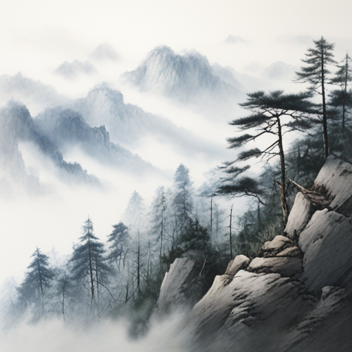 | 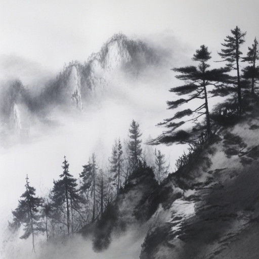 |  |  |

### Prompt 02

> **Prompt**: *"Winding river flowing through steep mountain gorges, distant waterfall, traditional Chinese ink wash painting style, shuimo hua"*

| Baseline (Step 0) | Step 4,000 (Optimal Ink Bleed) | Step 7,000 (Top Joint Score) | Step 10,000 (Late Checkpoint) |
| :---: | :---: | :---: | :---: |
|  | 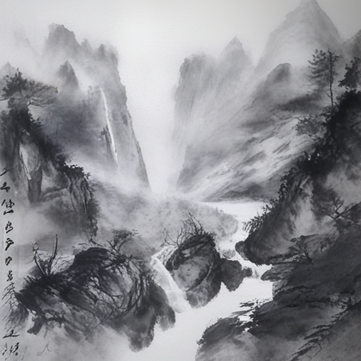 |  | 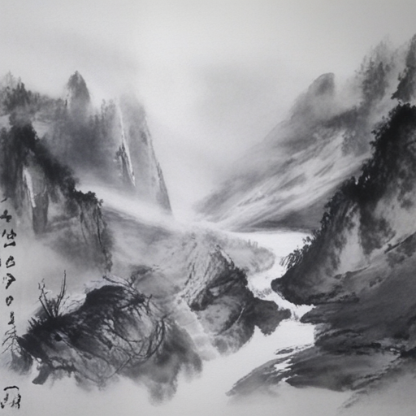 |

### Prompt 03

> **Prompt**: *"Cascading waterfall plunging into a misty ravine, jagged rock formations, traditional Chinese ink wash painting style, shuimo hua"*

| Baseline (Step 0) | Step 4,000 (Optimal Ink Bleed) | Step 7,000 (Top Joint Score) | Step 10,000 (Late Checkpoint) |
| :---: | :---: | :---: | :---: |
| 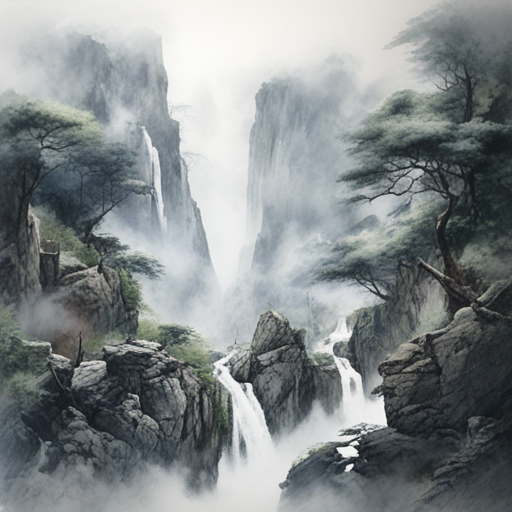 |  |  |  |

### Prompt 04

> **Prompt**: *"Snow-covered mountain range in winter, bare trees, frozen lake, traditional Chinese ink wash painting style, shuimo hua"*

| Baseline (Step 0) | Step 4,000 (Optimal Ink Bleed) | Step 7,000 (Top Joint Score) | Step 10,000 (Late Checkpoint) |
| :---: | :---: | :---: | :---: |
|  |  | 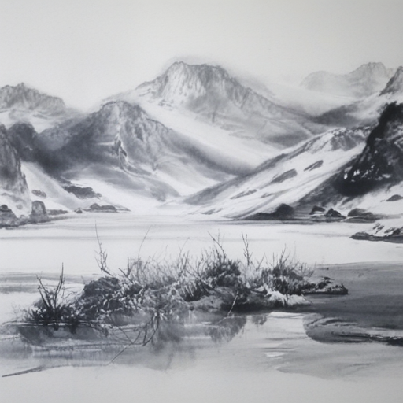 |  |

### Prompt 05

> **Prompt**: *"Autumn mountains with sparse foliage, winding stone path leading to a ridge, traditional Chinese ink wash painting style, shuimo hua"*

| Baseline (Step 0) | Step 4,000 (Optimal Ink Bleed) | Step 7,000 (Top Joint Score) | Step 10,000 (Late Checkpoint) |
| :---: | :---: | :---: | :---: |
| 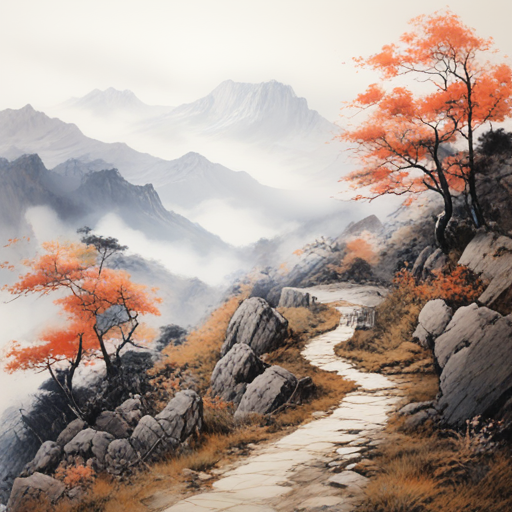 |  | 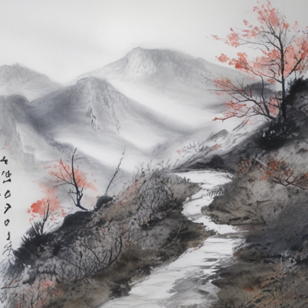 |  |

### Prompt 06

> **Prompt**: *"Sunrise over sea of clouds and mountain spires, high contrast black ink brushwork, white space, traditional Chinese ink wash painting style, shuimo hua"*

| Baseline (Step 0) | Step 4,000 (Optimal Ink Bleed) | Step 7,000 (Top Joint Score) | Step 10,000 (Late Checkpoint) |
| :---: | :---: | :---: | :---: |
|  | 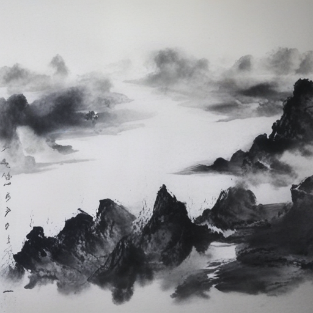 |  | 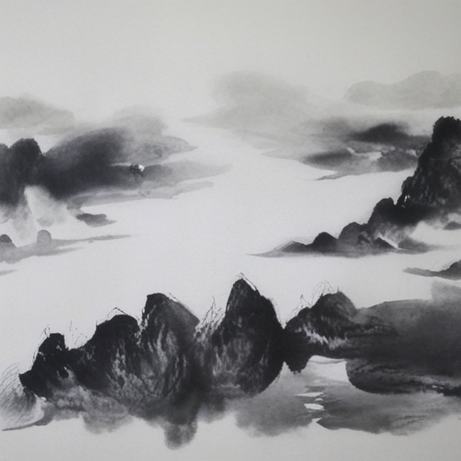 |

### Prompt 07

> **Prompt**: *"Quiet lake reflecting towering mountain shadows, serene water surface, traditional Chinese ink wash painting style, shuimo hua"*

| Baseline (Step 0) | Step 4,000 (Optimal Ink Bleed) | Step 7,000 (Top Joint Score) | Step 10,000 (Late Checkpoint) |
| :---: | :---: | :---: | :---: |
|  | 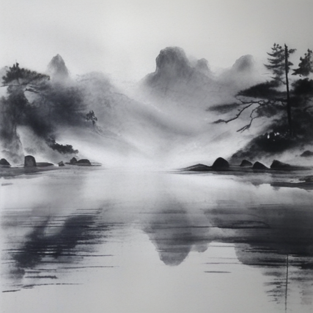 |  | 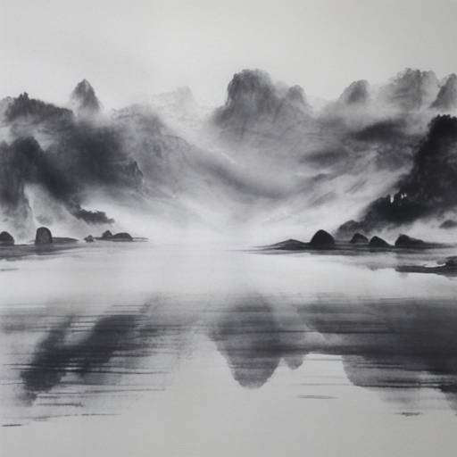 |

### Prompt 08

> **Prompt**: *"Storm clouds gathering above rugged cliffside pines, dynamic black ink splash technique, traditional Chinese ink wash painting style, shuimo hua"*

| Baseline (Step 0) | Step 4,000 (Optimal Ink Bleed) | Step 7,000 (Top Joint Score) | Step 10,000 (Late Checkpoint) |
| :---: | :---: | :---: | :---: |
|  |  | 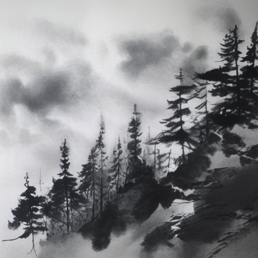 |  |

---
## 🎨 Category: Flora & Fauna (花鳥)

### Prompt 09

> **Prompt**: *"Ink wash bamboo in the wind, wet brush technique, delicate leaves, subtle grey tones, traditional Chinese ink wash painting style, shuimo hua"*

| Baseline (Step 0) | Step 4,000 (Optimal Ink Bleed) | Step 7,000 (Top Joint Score) | Step 10,000 (Late Checkpoint) |
| :---: | :---: | :---: | :---: |
| 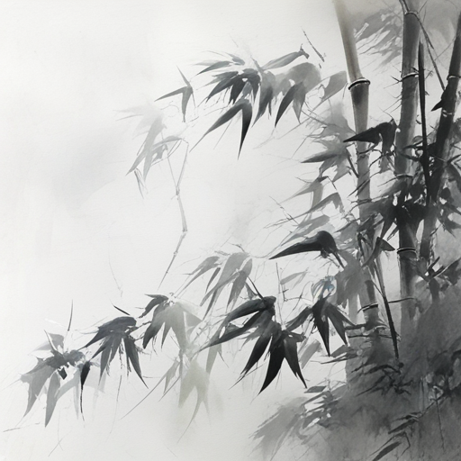 | 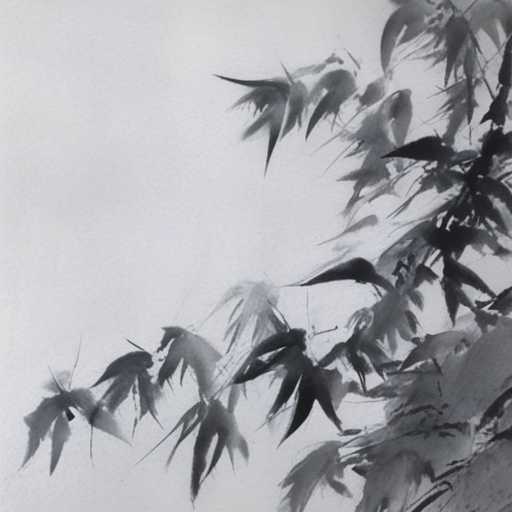 |  |  |

### Prompt 10

> **Prompt**: *"A pair of flying cranes soaring above misty clouds, elegant brushstrokes, traditional Chinese ink wash painting style, shuimo hua"*

| Baseline (Step 0) | Step 4,000 (Optimal Ink Bleed) | Step 7,000 (Top Joint Score) | Step 10,000 (Late Checkpoint) |
| :---: | :---: | :---: | :---: |
| 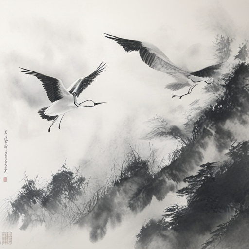 |  | 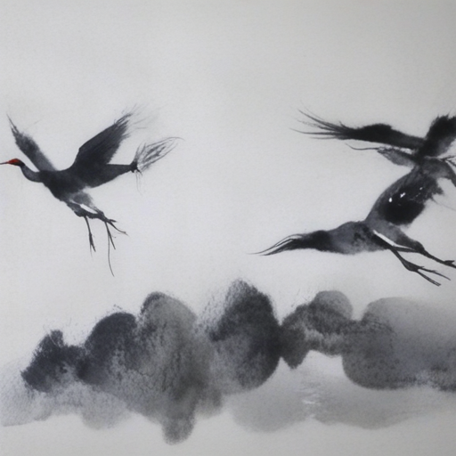 | 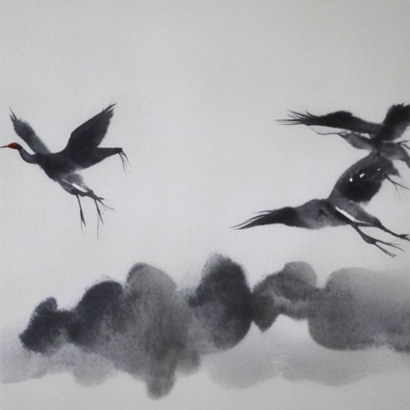 |

### Prompt 11

> **Prompt**: *"Blooming plum blossoms on a gnarled branch, delicate ink wash gradients, soft grey background, traditional Chinese ink wash painting style, shuimo hua"*

| Baseline (Step 0) | Step 4,000 (Optimal Ink Bleed) | Step 7,000 (Top Joint Score) | Step 10,000 (Late Checkpoint) |
| :---: | :---: | :---: | :---: |
|  | 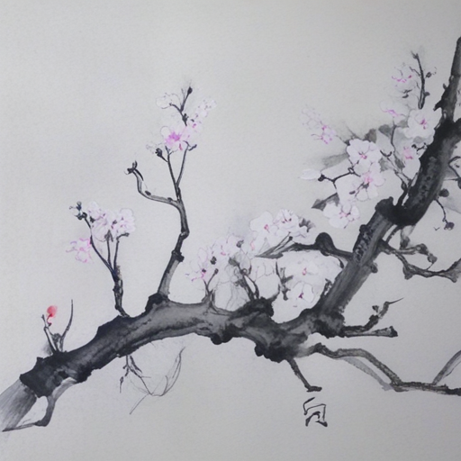 | 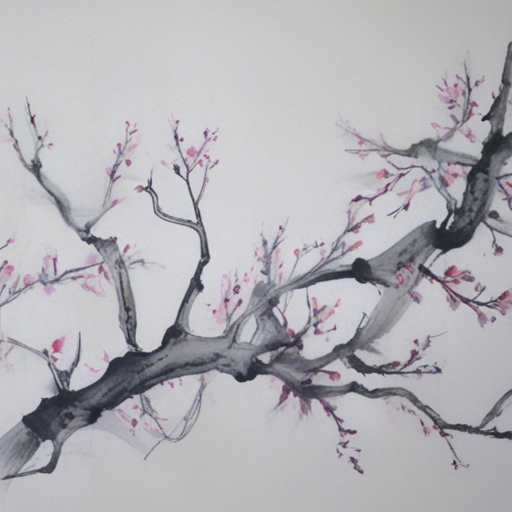 |  |

### Prompt 12

> **Prompt**: *"Solitary eagle perched on an ancient pine branch, sharp gaze, bold black ink brushwork, traditional Chinese ink wash painting style, shuimo hua"*

| Baseline (Step 0) | Step 4,000 (Optimal Ink Bleed) | Step 7,000 (Top Joint Score) | Step 10,000 (Late Checkpoint) |
| :---: | :---: | :---: | :---: |
| 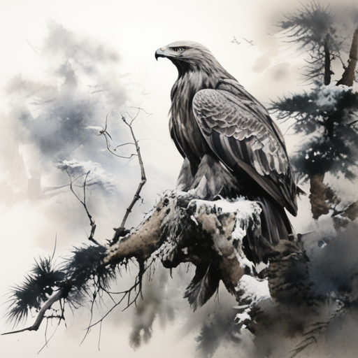 |  | 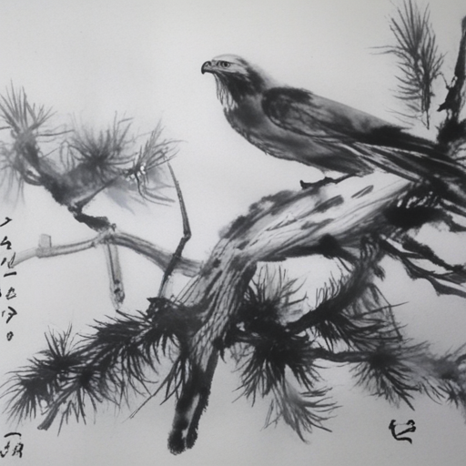 |  |

### Prompt 13

> **Prompt**: *"Lotus flowers blooming in a quiet pond, large wet ink leaves, dragonfly hovering, traditional Chinese ink wash painting style, shuimo hua"*

| Baseline (Step 0) | Step 4,000 (Optimal Ink Bleed) | Step 7,000 (Top Joint Score) | Step 10,000 (Late Checkpoint) |
| :---: | :---: | :---: | :---: |
| 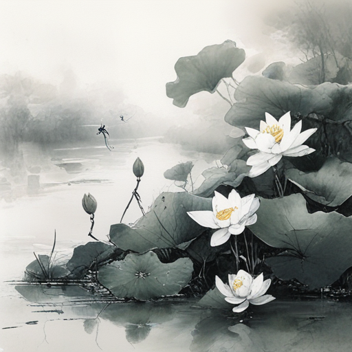 |  | 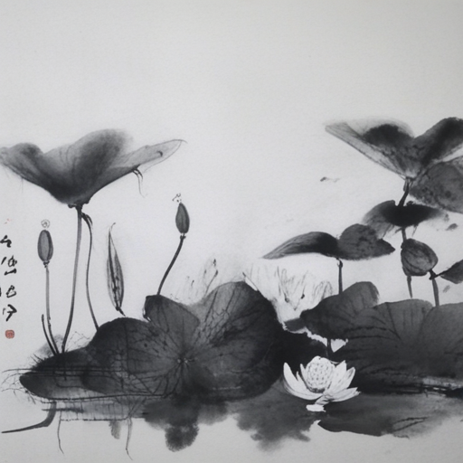 | 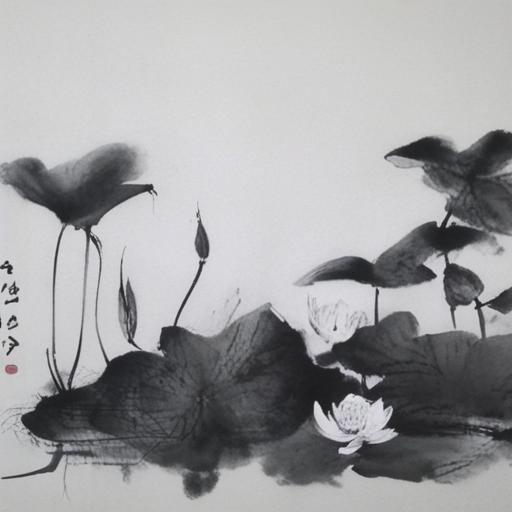 |

### Prompt 14

> **Prompt**: *"A wild horse galloping across an open plain, dynamic ink wash style, fluid brush lines, traditional Chinese ink wash painting style, shuimo hua"*

| Baseline (Step 0) | Step 4,000 (Optimal Ink Bleed) | Step 7,000 (Top Joint Score) | Step 10,000 (Late Checkpoint) |
| :---: | :---: | :---: | :---: |
| 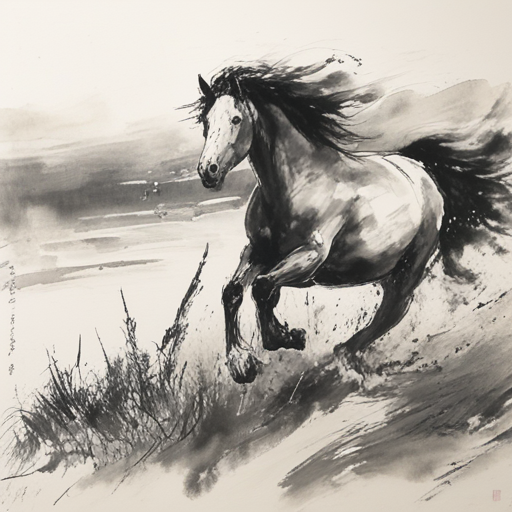 | 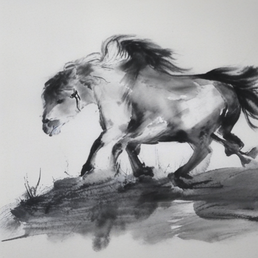 |  |  |

### Prompt 15

> **Prompt**: *"Wild orchids clinging to a mossy cliff, graceful curved leaves, minimalist ink wash style, traditional Chinese ink wash painting style, shuimo hua"*

| Baseline (Step 0) | Step 4,000 (Optimal Ink Bleed) | Step 7,000 (Top Joint Score) | Step 10,000 (Late Checkpoint) |
| :---: | :---: | :---: | :---: |
|  | 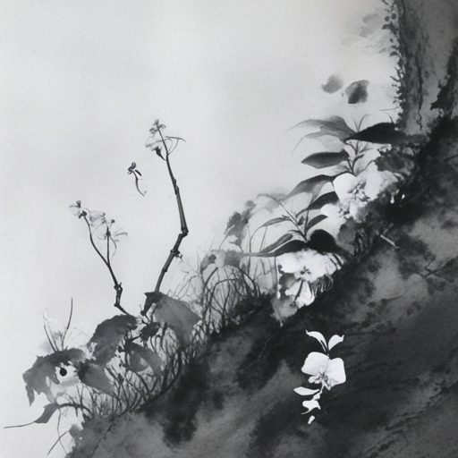 |  | 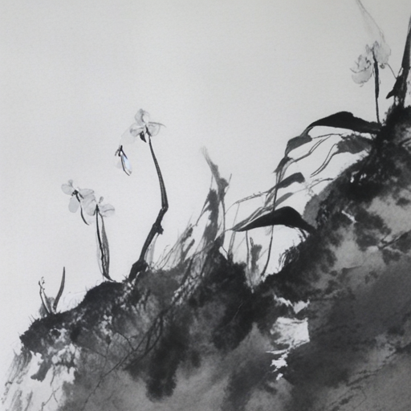 |

### Prompt 16

> **Prompt**: *"Koi fish swimming in clear water, soft ink wash ripples, transparent ink gradients, traditional Chinese ink wash painting style, shuimo hua"*

| Baseline (Step 0) | Step 4,000 (Optimal Ink Bleed) | Step 7,000 (Top Joint Score) | Step 10,000 (Late Checkpoint) |
| :---: | :---: | :---: | :---: |
| 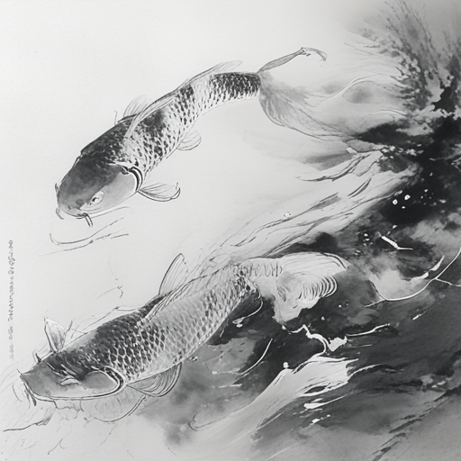 | 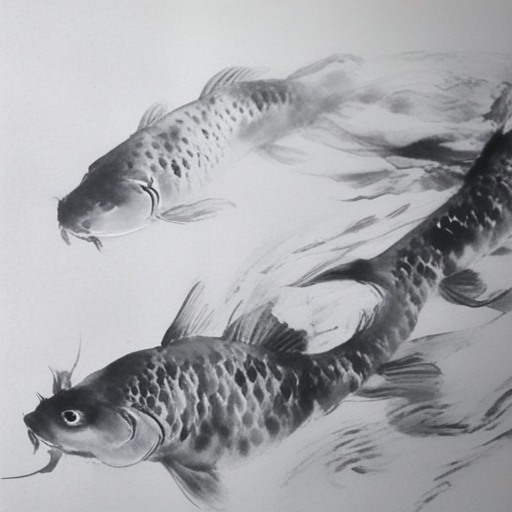 | 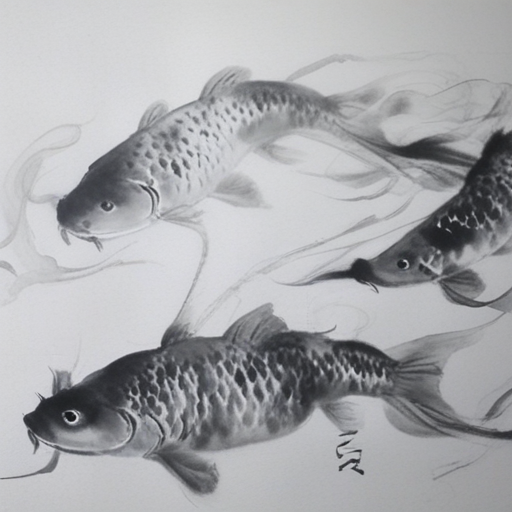 | 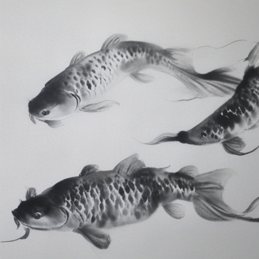 |

---
## 🎨 Category: Minimalist Composition (意境/留白)

### Prompt 17

> **Prompt**: *"A single small boat on a vast calm lake, minimalist composition, wide white space, traditional Chinese ink wash painting style, shuimo hua"*

| Baseline (Step 0) | Step 4,000 (Optimal Ink Bleed) | Step 7,000 (Top Joint Score) | Step 10,000 (Late Checkpoint) |
| :---: | :---: | :---: | :---: |
|  | 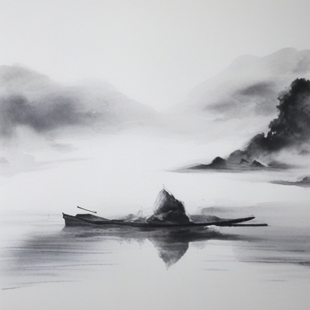 | 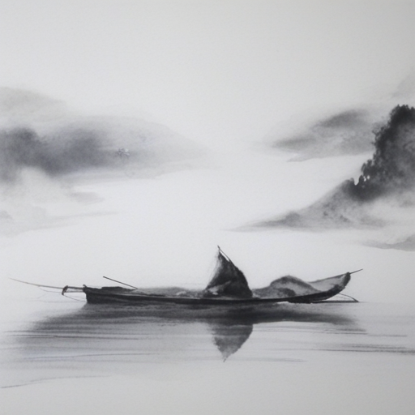 | 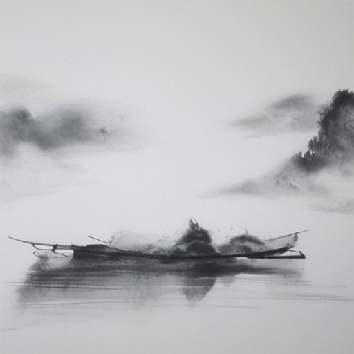 |

### Prompt 18

> **Prompt**: *"Solitary fisherman sitting on a riverbank with a fishing rod, vast empty background, traditional Chinese ink wash painting style, shuimo hua"*

| Baseline (Step 0) | Step 4,000 (Optimal Ink Bleed) | Step 7,000 (Top Joint Score) | Step 10,000 (Late Checkpoint) |
| :---: | :---: | :---: | :---: |
| 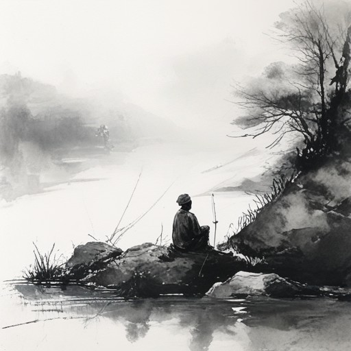 |  |  |  |

### Prompt 19

> **Prompt**: *"Single bamboo stalk in the corner of a blank paper canvas, elegant white space composition, traditional Chinese ink wash painting style, shuimo hua"*

| Baseline (Step 0) | Step 4,000 (Optimal Ink Bleed) | Step 7,000 (Top Joint Score) | Step 10,000 (Late Checkpoint) |
| :---: | :---: | :---: | :---: |
|  | 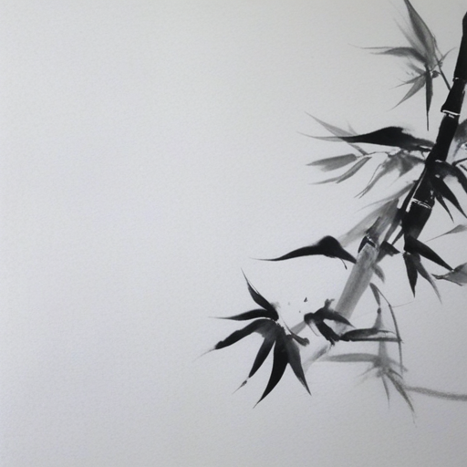 |  |  |

### Prompt 20

> **Prompt**: *"A lone pine tree silhouette against a faint crescent moon, subtle grey wash, high negative space, traditional Chinese ink wash painting style, shuimo hua"*

| Baseline (Step 0) | Step 4,000 (Optimal Ink Bleed) | Step 7,000 (Top Joint Score) | Step 10,000 (Late Checkpoint) |
| :---: | :---: | :---: | :---: |
|  |  | 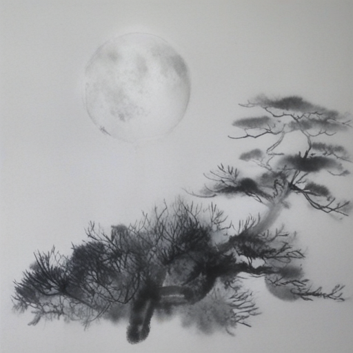 |  |

### Prompt 21

> **Prompt**: *"Faint outline of a distant mountain peak in heavy fog, minimalist ink wash composition, wide white space, traditional Chinese ink wash painting style, shuimo hua"*

| Baseline (Step 0) | Step 4,000 (Optimal Ink Bleed) | Step 7,000 (Top Joint Score) | Step 10,000 (Late Checkpoint) |
| :---: | :---: | :---: | :---: |
| 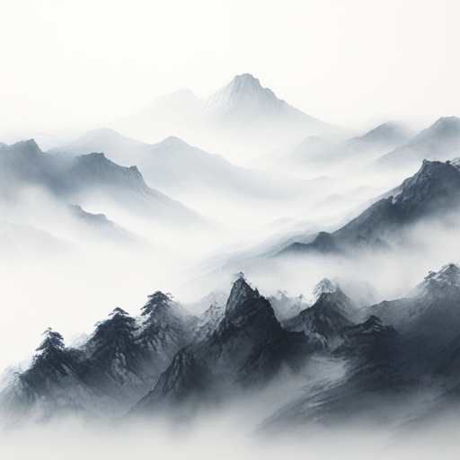 | 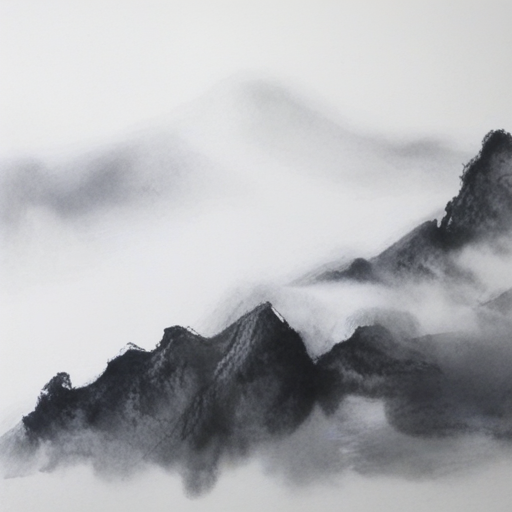 | 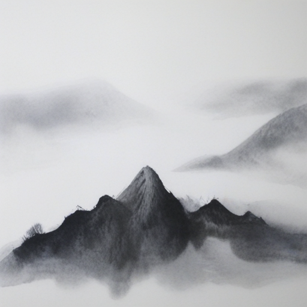 |  |

### Prompt 22

> **Prompt**: *"A single falling leaf landing on still water, delicate ink ripple lines, minimalist composition, traditional Chinese ink wash painting style, shuimo hua"*

| Baseline (Step 0) | Step 4,000 (Optimal Ink Bleed) | Step 7,000 (Top Joint Score) | Step 10,000 (Late Checkpoint) |
| :---: | :---: | :---: | :---: |
| 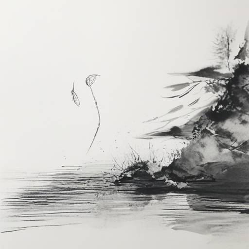 |  |  | 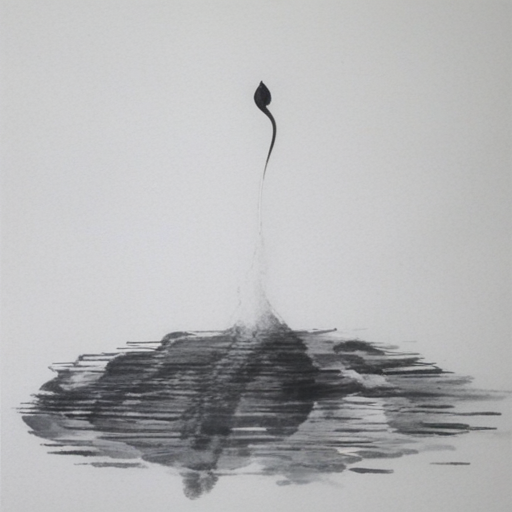 |

### Prompt 23

> **Prompt**: *"Distant flight of birds vanishing into empty mist, minimalist composition, wide negative space, traditional Chinese ink wash painting style, shuimo hua"*

| Baseline (Step 0) | Step 4,000 (Optimal Ink Bleed) | Step 7,000 (Top Joint Score) | Step 10,000 (Late Checkpoint) |
| :---: | :---: | :---: | :---: |
| 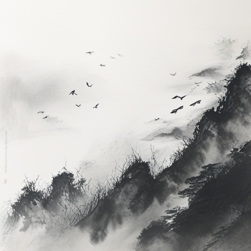 |  |  | 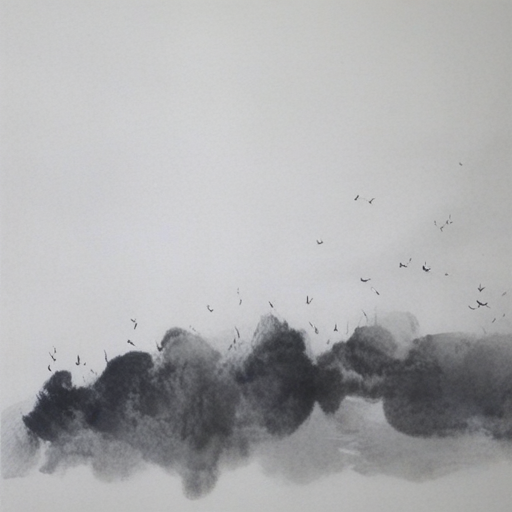 |

---
## 🎨 Category: Architecture & Figures (人物/亭台)

### Prompt 24

> **Prompt**: *"Ancient wooden pavilion surrounded by swirling mountain fog, traditional Chinese ink wash painting style, shuimo hua"*

| Baseline (Step 0) | Step 4,000 (Optimal Ink Bleed) | Step 7,000 (Top Joint Score) | Step 10,000 (Late Checkpoint) |
| :---: | :---: | :---: | :---: |
|  | 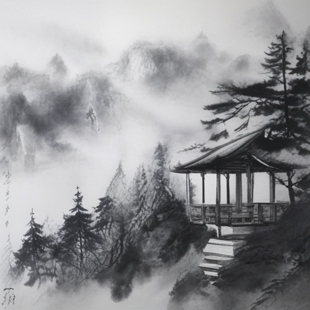 | 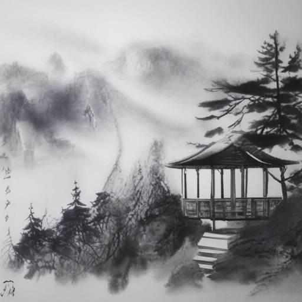 |  |

### Prompt 25

> **Prompt**: *"Ancient scholar walking along a winding stone path, traditional robes, traditional Chinese ink wash painting style, shuimo hua"*

| Baseline (Step 0) | Step 4,000 (Optimal Ink Bleed) | Step 7,000 (Top Joint Score) | Step 10,000 (Late Checkpoint) |
| :---: | :---: | :---: | :---: |
| 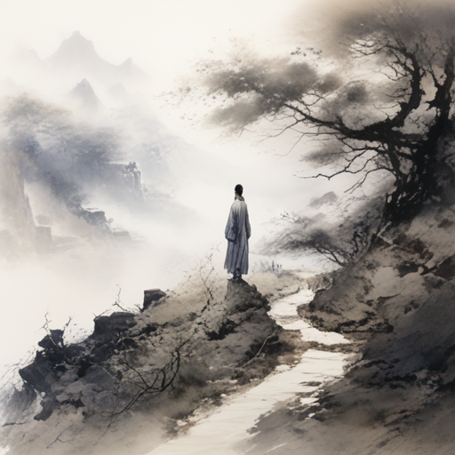 |  |  |  |

### Prompt 26

> **Prompt**: *"Secluded stone temple tucked in a deep pine forest, mist rising, detailed architecture, traditional Chinese ink wash painting style, shuimo hua"*

| Baseline (Step 0) | Step 4,000 (Optimal Ink Bleed) | Step 7,000 (Top Joint Score) | Step 10,000 (Late Checkpoint) |
| :---: | :---: | :---: | :---: |
| 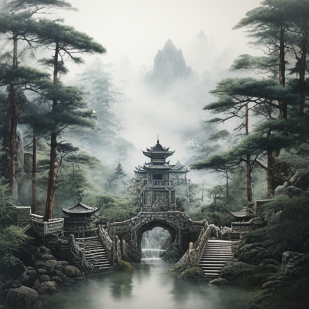 |  | 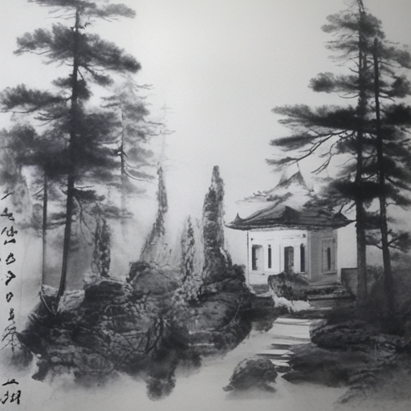 |  |

### Prompt 27

> **Prompt**: *"Traditional thatched cottage near a bamboo grove, flowing stream, traditional Chinese ink wash painting style, shuimo hua"*

| Baseline (Step 0) | Step 4,000 (Optimal Ink Bleed) | Step 7,000 (Top Joint Score) | Step 10,000 (Late Checkpoint) |
| :---: | :---: | :---: | :---: |
|  |  |  | 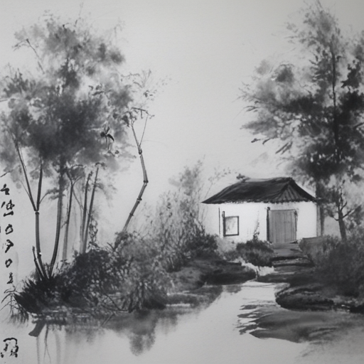 |

### Prompt 28

> **Prompt**: *"Ancient stone bridge spanning a misty river, small pavilion on a cliff, traditional Chinese ink wash painting style, shuimo hua"*

| Baseline (Step 0) | Step 4,000 (Optimal Ink Bleed) | Step 7,000 (Top Joint Score) | Step 10,000 (Late Checkpoint) |
| :---: | :---: | :---: | :---: |
| 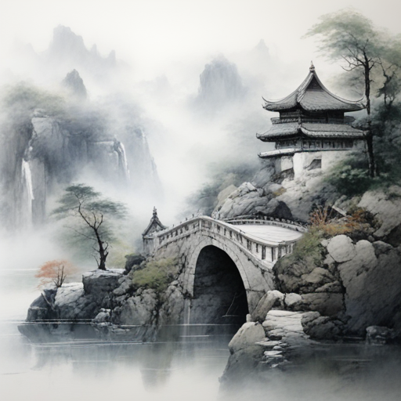 | 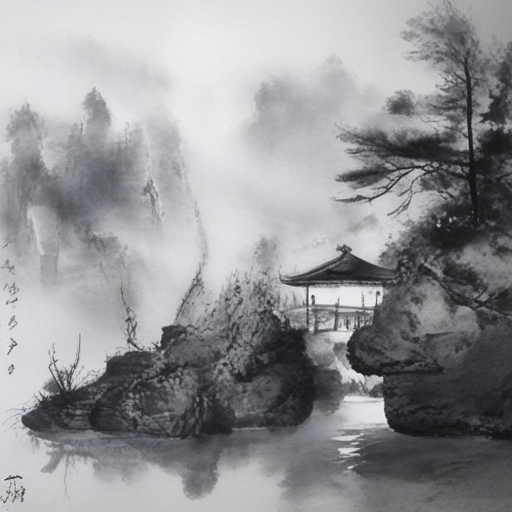 | 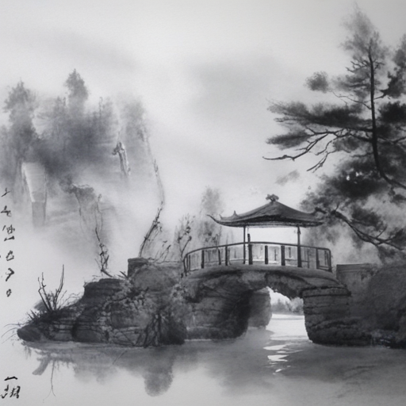 |  |

### Prompt 29

> **Prompt**: *"Old scholar sitting inside a pavilion reading a book, mountain view, detailed ink wash technique, traditional Chinese ink wash painting style, shuimo hua"*

| Baseline (Step 0) | Step 4,000 (Optimal Ink Bleed) | Step 7,000 (Top Joint Score) | Step 10,000 (Late Checkpoint) |
| :---: | :---: | :---: | :---: |
|  | 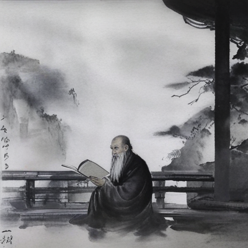 | 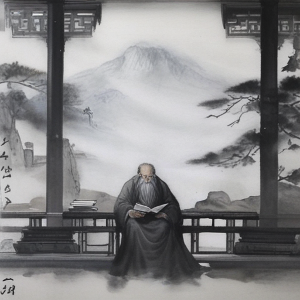 |  |

### Prompt 30

> **Prompt**: *"Winding mountain staircase leading to a cloud-wrapped pagoda, traditional Chinese ink wash painting style, shuimo hua"*

| Baseline (Step 0) | Step 4,000 (Optimal Ink Bleed) | Step 7,000 (Top Joint Score) | Step 10,000 (Late Checkpoint) |
| :---: | :---: | :---: | :---: |
|  | 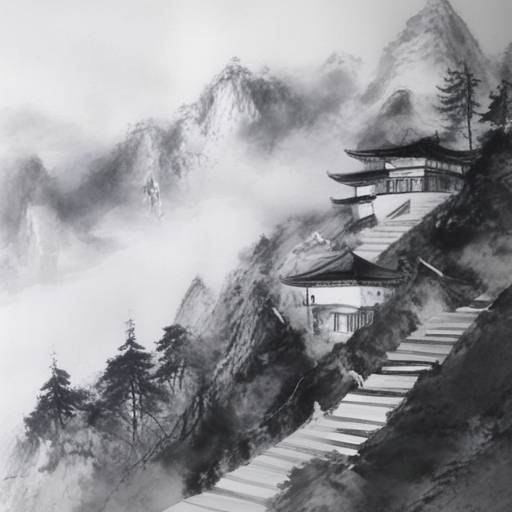 |  |  |

