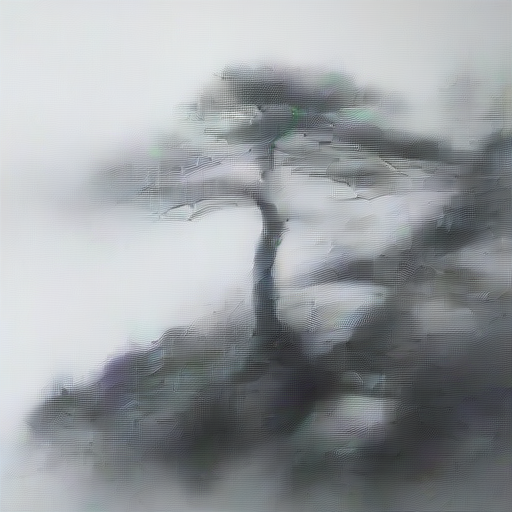
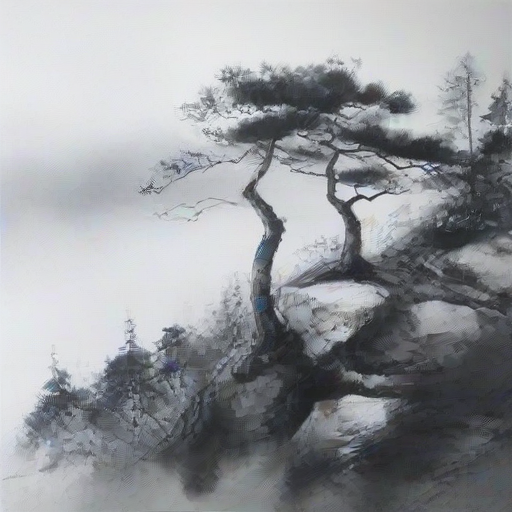
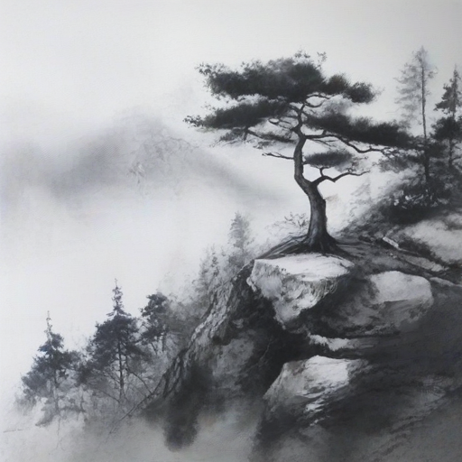
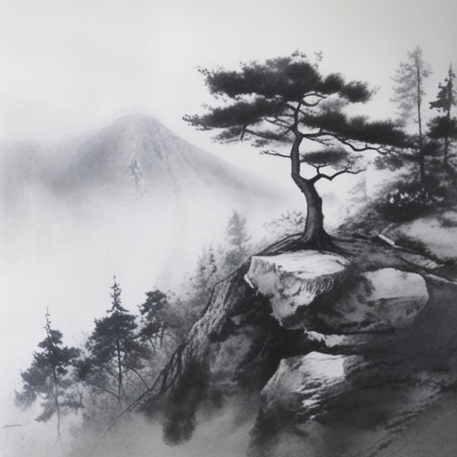

# ⚡ Inference Sampling Steps Guide (`--num-inference-steps`)

This report evaluates the visual, technical, and quantitative impact of varying **sampling inference steps** (`--num-inference-steps`) on our **Best Model (`plant209` Step 4,000)** at `guidance_scale = 1.5` and `seed = 42`.

---

## ⚙️ Denoising Dynamics Across Inference Steps

In Diffusion Transformer models (PixArt-Sigma), **Inference Steps** (`num_inference_steps`) control the number of iterative denoising steps executed by the ODE/SDE solver during image synthesis:

$$\mathbf{z}_{t-1} = \text{Denoise}(\mathbf{z}_t, t, \mathbf{c})$$

- **Extremely Low Steps ($\le 4$)**: Solver takes steps that are far too large ($\Delta t \ge 0.25$). The image remains mostly Gaussian noise with severe blurriness and unrecognizable gray blobs.
- **Fast Preview Window ($10 - 14$)**: The solver resolves main subjects and composition; text-image alignment peaks at **14 steps** (`CLIPScore: 0.3973`).
- **Optimal Production Window ($20 - 28$)**: Full latent trajectory convergence yielding soft ink bleeding (墨韻), crisp pine needles, and clean negative space (留白).
- **Too Many Steps ($\ge 50$)**: Solvers reach numerical convergence; visual changes become negligible while generation latency increases linearly.

---

## 📊 Full Empirical Step Benchmark Table

| Inference Steps (`num_inference_steps`) | CLIPScore (↑) | Avg Latency | Relative Speed | Aesthetic Status (墨韻 / 筆觸 / 留白) | Practical Recommendation |
| :---: | :---: | :---: | :---: | :--- | :--- |
| ❌ **`2` Steps** | **`0.2964`** | **~4.1s** | ⚡ **4.4x Faster** | ⚠️ **Severe Noise & Blurriness**: Unresolved noise; unrecognizable gray blob. | ❌ **Do Not Use** |
| ❌ **`4` Steps** | **`0.2979`** | **~6.2s** | ⚡ **2.9x Faster** | ⚠️ **Coarse Outlines**: Basic shapes appear, but pine needles & ink washes are missing. | ❌ **Do Not Use** |
| 🚀 **`10` Steps** | **`0.3777`** | **~10.1s** | ⚡ **1.8x Faster** | Blurrier background fog; pine needles lack fine line definition. | 🚀 Fast Draft / Quick Preview |
| 🎨 **`14` Steps** | **`0.3973`** 🥇 | **~12.8s** | ⚡ **1.4x Faster** | 🥇 **Peak Text Alignment**: Crisp composition, fast generation speed. | 🎨 Rapid Prototyping |
| 🏆 **`20` Steps** | **`0.3897`** 🌟 | **~18.1s** | ⚖️ **1.0x (Default)** | 🌟 **Optimal Production Standard**: Soft wet ink diffusion (墨韻) & clean white space. | 🏆 **Default Production Standard** |
| 🖼️ **`28` Steps** | **`0.3857`** | **~24.6s** | 🐢 **1.4x Slower** | Refined fine-line detail; ultra-smooth negative space transitions. | 🖼️ High Resolution Final Render |
| 🐢 **`50` Steps** | **`0.3880`** | **~44.8s** | 🐢 **2.5x Slower** | **Diminishing Returns**: Visually identical to 28 steps. | ❌ Not Recommended |

---

## 🖼️ Visual Progression Across Inference Steps

| 2 Steps (Noise) | 4 Steps (Coarse) | 10 Steps (Draft) | 14 Steps (Peak Alignment) | 20 Steps (Default) | 28 Steps (Fine Detail) |
| :---: | :---: | :---: | :---: | :---: | :---: |
|  |  |  |  |  |  |

---

## 💡 Practical Recommendations

1. **Default Production Standard**: Use **`--num-inference-steps 20`** (~18s). It provides the ideal balance of fast inference speed, authentic wet ink diffusion (墨韻), and crisp brushwork.
2. **Fast Prototyping**: Use **`--num-inference-steps 14`** (~12.8s) when testing new prompt ideas quickly.
3. **Avoid $\le 4$ Steps**: Standard diffusion models require at least 14 steps to resolve noise without consistency distillation (LCM/TCD).
