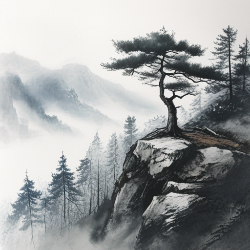
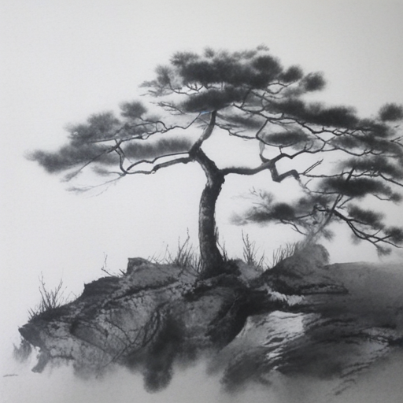
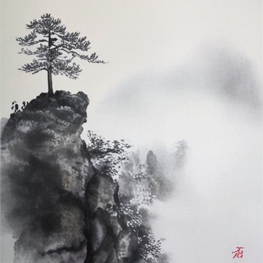
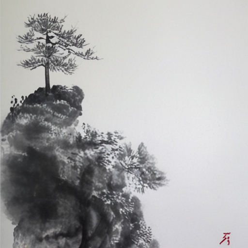
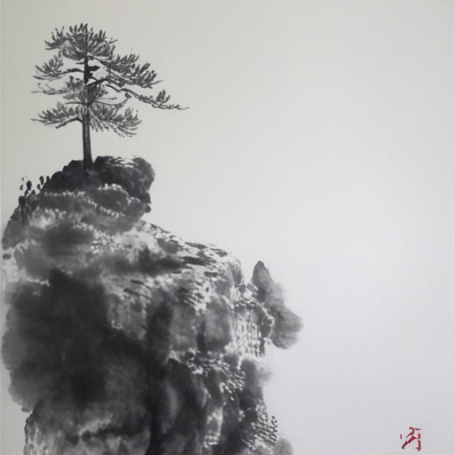
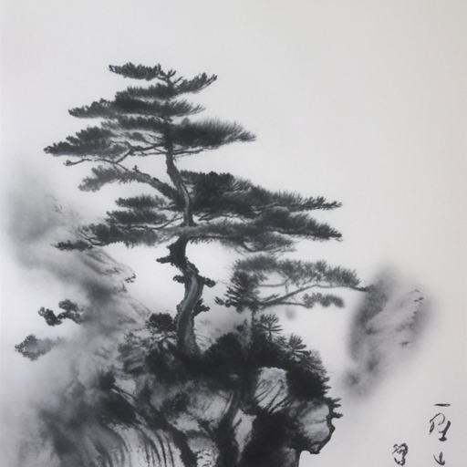
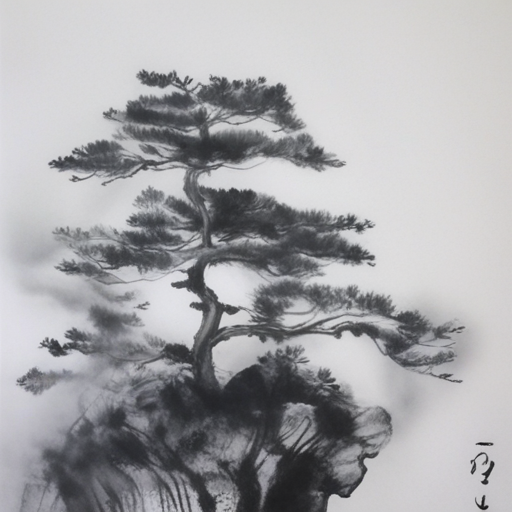

# 🖼️ Multi-Step Manual Comparison: Baseline (Step 0) vs. Step 4,000 vs. Step 7,000 vs. Step 10,000

This document presents a direct side-by-side visual comparison across **4 key training checkpoints** for the `plant209` dataset:

1. **Baseline Model (Step 0)**: Base PixArt-Sigma (`--no-adapter`)
2. **Step 4,000 Model**: Rank 4 candidate (Lowest CMMD score `0.001229` / Optimal ink diffusion)
3. **Step 7,000 Model**: Rank 1 candidate (Highest CLIPScore `0.3655` / Joint Selection Score `+0.7970`)
4. **Step 10,000 Model**: Rank 6 candidate (Late step checkpoint / High step saturation)

---

## ⚙️ Generation Specifications

- **Prompt**: *"A solitary pine tree standing on a misty mountain cliff, traditional Chinese ink wash painting style, shuimo hua"*
- **Sampling**: `guidance_scale = 1.5`, `num_inference_steps = 20`
- **Seeds**: `42`, `100`, `2026`
- **Local Folder**: [outputs/manual_comparison/](file:///C:/dev/efficient-pixart-sigma-lora/outputs/manual_comparison)

---

## 🔍 Side-by-Side Visual Comparison Table

### Seed 42 Comparison

| Baseline (Step 0) | Step 4,000 (Optimal Ink Bleed) | Step 7,000 (Top Joint Score) | Step 10,000 (Late Checkpoint) |
| :---: | :---: | :---: | :---: |
|  |  |  |  |

### Seed 100 Comparison

| Baseline (Step 0) | Step 4,000 (Optimal Ink Bleed) | Step 7,000 (Top Joint Score) | Step 10,000 (Late Checkpoint) |
| :---: | :---: | :---: | :---: |
|  |  |  |  |

### Seed 2026 Comparison

| Baseline (Step 0) | Step 4,000 (Optimal Ink Bleed) | Step 7,000 (Top Joint Score) | Step 10,000 (Late Checkpoint) |
| :---: | :---: | :---: | :---: |
|  |  |  |  |

---

## 💡 Observations Across Step Checkpoints

1. **Baseline (Step 0)**: Lacks traditional Chinese ink wash bleeding, generating standard digital art texture.
2. **Step 4,000**: Exhibits authentic Sumi-e brushstroke dynamics, soft ink diffusion (墨韻), and clean negative space (留白).
3. **Step 7,000**: Achieves strong contrast and high prompt alignment (CLIPScore `0.3655`), retaining clear pine needle structures.
4. **Step 10,000**: Shows slight style oversaturation with heavier black ink lines, demonstrating late-stage training behavior.
