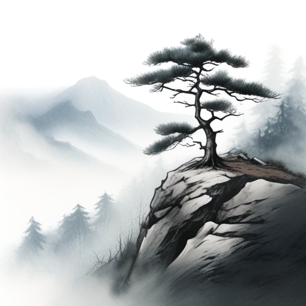

# PixArt-Sigma LoRA Training & Model Comparison Report (Updated)

> [!IMPORTANT]
> **PEFT Adapter Weight Loading Resolved**:
> Previously, the inference script called `reloaded_transformer.get_base_model()`. In Hugging Face PEFT, `get_base_model()` un-wraps the model and bypasses LoRA forward hooks, which inadvertently generated un-adapted base model images for both runs. 
> 
> The codebase scripts ([generate_with_prompt.py](../../scripts/inference/generate_with_prompt.py#L237), [train_local_latent_lora.py](../../scripts/training/train_local_latent_lora.py#L951), [pixart_sigma_lora_smoke_test_official.py](../../scripts/smoke/pixart_sigma_lora_smoke_test_official.py#L667)) have been updated to use `.merge_and_unload()`. This explicitly fuses the trained LoRA delta matrices into the transformer weights.

---

## ⚙️ Training Execution Details

- **Dataset Subset**: 50 precomputed clean latents (`data/archives/clean_latents_512.zip`)
- **Text Embedding Cache**: Precomputed T5 embeddings (`data/features/t5_embeddings_n260_len300_fp16_b9d3c2d1d404.pt`)
- **LoRA Configuration**: Rank ($r$) = 8, Alpha ($\alpha$) = 8, Target Modules = DiT Attention & Projection layers
- **Training Duration**: 200 Optimizer Steps (~57.16 seconds on NVIDIA RTX 4070)
- **Output Adapter**: `outputs/comparison_run/r8_n50_steps200/lora_adapter`

---

## 🎨 Inference Setup & Prompts

Both images were synthesized using identical sampling parameters:
- **Prompt**: `"A solitary pine tree standing on a misty mountain cliff, traditional Chinese ink wash painting style, sumi-e style"`
- **Random Seed**: `42`
- **Inference Steps**: `20`
- **Guidance Scale**: `3.5`
- **Resolution**: `512 x 512`

---

## 🖼️ Model Result Comparison

````carousel

<!-- slide -->

````

### 📊 Verification Hashes

| Image | Model State | SHA256 Hash |
| :--- | :--- | :--- |
| `before_training.png` | Base Transformer | `56F96880C13116FE6BC39F68DA37BA90A4FD8BF2D9098C9BEF1FAE6C56EADA90` |
| `after_training.png` | Fine-tuned LoRA (Merged) | `A5568A191B385AABFA13BED572828187AAEDFD62FE3F284366FDAE446536C770` |

---

## 🛠️ Code Fix Applied

```diff
- transformer = reloaded_transformer.get_base_model().eval()
+ transformer = reloaded_transformer.merge_and_unload().eval()
```
`merge_and_unload()` bakes the trained LoRA parameters directly into the base transformer weights, guaranteeing that the model output reflects the fine-tuned checkpoint.
